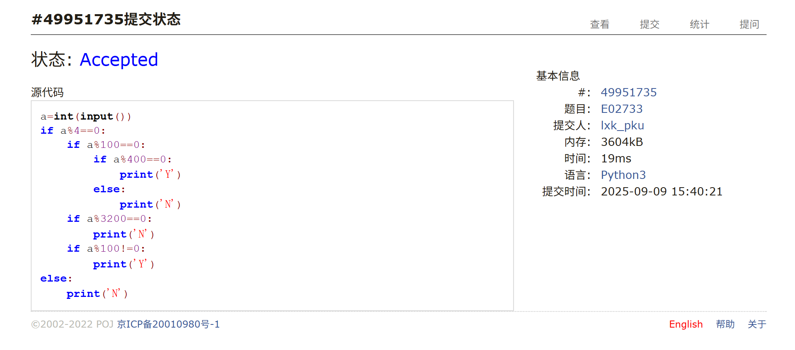
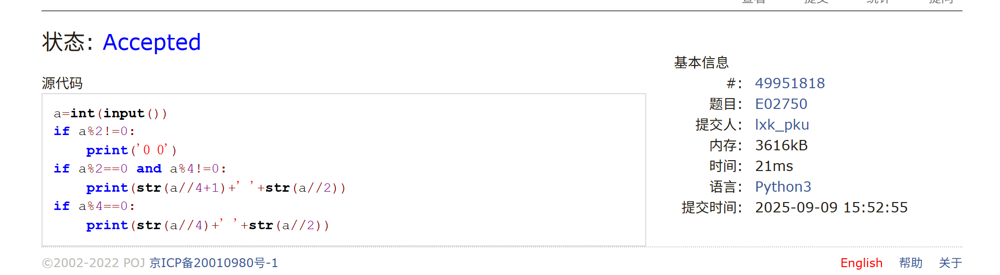
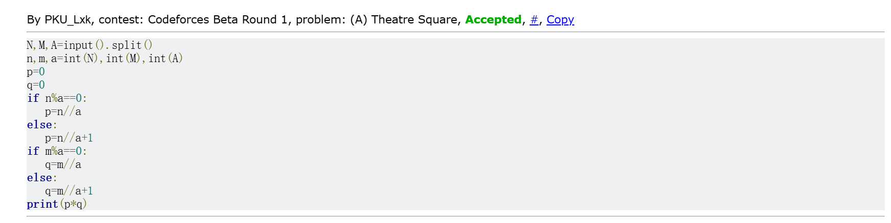
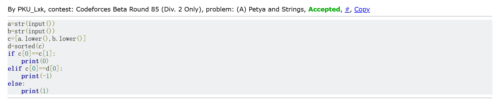
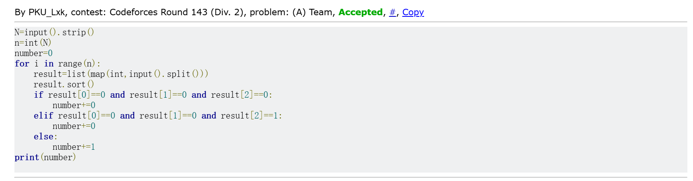

# Assignment #1: 自主学习

Updated 1427 GMT+8 Sep 9, 2025

2025 fall, Complied by 物理学院 李欣珂


**作业的各项评分细则及对应的得分**

| 标准                                 | 等级                                                         | 得分 |
| ------------------------------------ | ------------------------------------------------------------ | ---- |
| 按时提交                             | 完全按时提交：1分<br/>提交有请假说明：0.5分<br/>未提交：0分  | 1 分 |
| 源码、耗时（可选）、解题思路（可选） | 提交了4个或更多题目且包含所有必要信息：1分<br/>提交了2个或以上题目但不足4个：0.5分<br/>少于2个：0分 | 1 分 |
| AC代码截图                           | 提交了4个或更多题目且包含所有必要信息：1分<br/>提交了2个或以上题目但不足4个：0.5分<br/>少于：0分 | 1 分 |
| 清晰头像、PDF文件、MD/DOC附件        | 包含清晰的Canvas头像、PDF文件以及MD或DOC格式的附件：1分<br/>缺少上述三项中的任意一项：0.5分<br/>缺失两项或以上：0分 | 1 分 |
| 学习总结和个人收获                   | 提交了学习总结和个人收获：1分<br/>未提交学习总结或内容不详：0分 | 1 分 |
| 总得分： 5                           | 总分满分：5分                                                |      |

>
>
>
>**说明：**
>
>1. **解题与记录：**
>
>   对于每一个题目，请提供其解题思路（可选），并附上使用Python或C++编写的源代码（确保已在OpenJudge， Codeforces，LeetCode等平台上获得Accepted）。请将这些信息连同显示“Accepted”的截图一起填写到下方的作业模板中。（推荐使用Typora https://typoraio.cn 进行编辑，当然你也可以选择Word。）无论题目是否已通过，请标明每个题目大致花费的时间。
>
>2. **课程平台：**课程网站位于Canvas平台（https://pku.instructure.com ）。该平台将在<mark>第2周</mark>选课结束后正式启用。在平台启用前，请先完成作业并将作业妥善保存。待Canvas平台激活后，再上传你的作业。
>
>3. **提交安排：**提交时，请首先上传PDF格式的文件，并将.md或.doc格式的文件作为附件上传至右侧的“作业评论”区。确保你的Canvas账户有一个清晰可见的本人头像，提交的文件为PDF格式，并且“作业评论”区包含上传的.md或.doc附件。
>
>4. **延迟提交：****如果你预计无法在截止日期前提交作业，请提前告知具体原因。这有助于我们了解情况并可能为你提供适当的延期或其他帮助。  
>
>请按照上述指导认真准备和提交作业，以保证顺利完成课程要求。


## 1. 题目

### E02733: 判断闰年

http://cs101.openjudge.cn/pctbook/E02733/


思路：当时写的时候以前学过的语法已经忘得差不多了，做的时候只是想着满足每个条件即可，个人认为写的比较乱，没有非常好的思路可言，也花了十分钟左右才ac


代码

```python
a=int(input())
if a%4==0:
    if a%100==0:
        if a%400==0:
            print('Y')
        else:
            print('N')
    if a%3200==0:
        print('N')
    if a%100!=0:
        print('Y')
else:
    print('N')

```


代码运行截图 ==（至少包含有"Accepted"）==



### E02750: 鸡兔同笼

http://cs101.openjudge.cn/pctbook/E02750/


思路：我做此题思路偏数学一点，可以直接得到各个情况满足的条件，然后直接判断，用时五分钟以内


代码

```python
a=int(input())
if a%2!=0:
    print('0 0')
if a%2==0 and a%4!=0:
    print(str(a//4+1)+' '+str(a//2))
if a%4==0:
    print(str(a//4)+' '+str(a//2))

```


代码运行截图 ==（至少包含有"Accepted"）==




### 50A. Domino piling

greedy, math, 800, http://codeforces.com/problemset/problem/50/A


思路：做了一两题后，部分语法回忆起来，这题我也很快解决了，分类并给出对应表达式即可


代码

```python
m,n=input().split()
M=int(m)
N=int(n)
if N%2!=0:
   print(M*(N//2)+M//2)
if N%2==0:
   print(M*(N//2))

```


代码运行截图 ==（至少包含有"Accepted"）==


### 1A. Theatre Square

math, 1000, https://codeforces.com/problemset/problem/1/A


思路：由于我对算法了解不算很深，这类题我都习惯于先从数学上分析，然后再用程序实现，本题用时大概十分钟以内


代码

```python
N,M,A=input().split()
n,m,a=int(N),int(M),int(A)
p=0
q=0
if n%a==0:
   p=n//a
else:
   p=n//a+1
if m%a==0:
   q=m//a
else:
   q=m//a+1  
print(p*q) 

```


代码运行截图 ==（至少包含有"Accepted"）==



### 112A. Petya and Strings

implementation, strings, 1000, http://codeforces.com/problemset/problem/112/A


思路：之前没系统学过排序，这题也是让我去仔细看了排序的用法，但是如果纯看做题时间应该五分钟左右


代码

```python
a=str(input())
b=str(input())
c=[a.lower(),b.lower()]
d=sorted(c)
if c[0]==c[1]:
    print(0)
elif c[0]==d[0]:
    print(-1)
else:
    print(1)

```


代码运行截图 ==（至少包含有"Accepted"）==



### 231A. Team

bruteforce, greedy, 800, http://codeforces.com/problemset/problem/231/A


思路：


代码

```python
N=input().strip()
n=int(N)
number=0
for i in range(n):
    result=list(map(int,input().split()))
    result.sort()
    if result[0]==0 and result[1]==0 and result[2]==0:
        number+=0
    elif result[0]==0 and result[1]==0 and result[2]==1:
        number+=0
    else:
        number+=1
print(number)

```


代码运行截图 ==（至少包含有"Accepted"）==



## 2. 学习总结和收获
本人属于是在中小学阶段有把编程当作兴趣，但是没有系统学习以及打竞赛，所以说可能只是熟悉一些简单的语法和算法，本周作业虽然不觉得非常困难，但只能说完成的不那么轻松，有复习也有起到学习新知的作用；
课下我一直在刷oj上的E题和少量M题（耗时极长，2h起步），有的E题也花费了我不少时间，学到了之前从来没有见过的一些语法。


