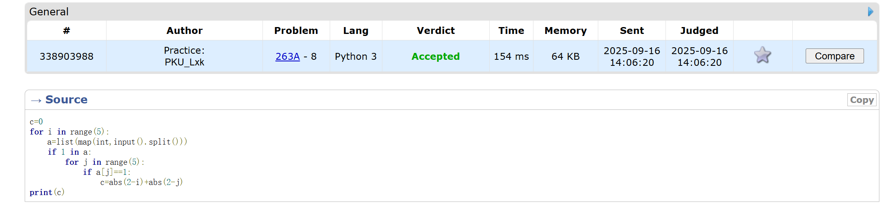
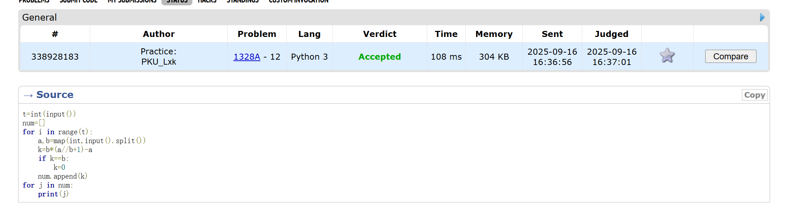
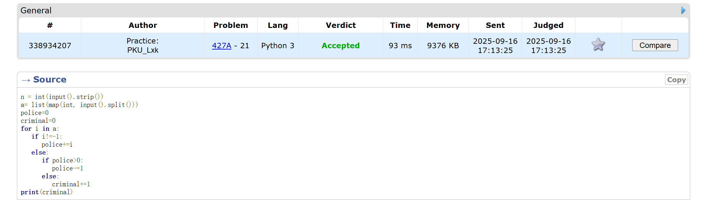
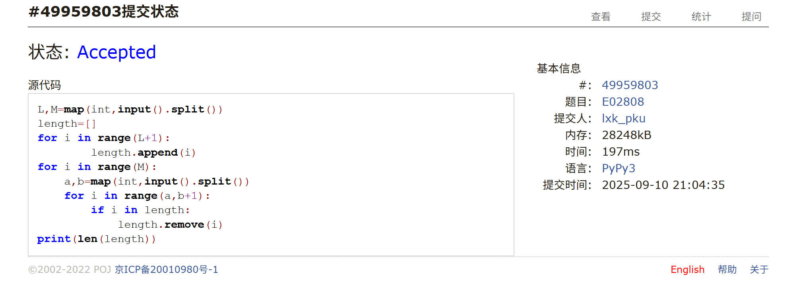
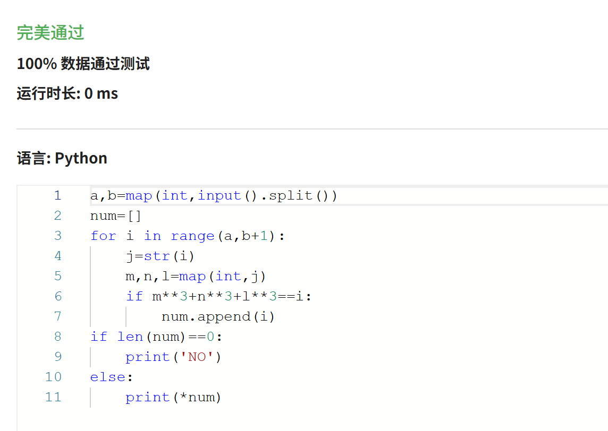
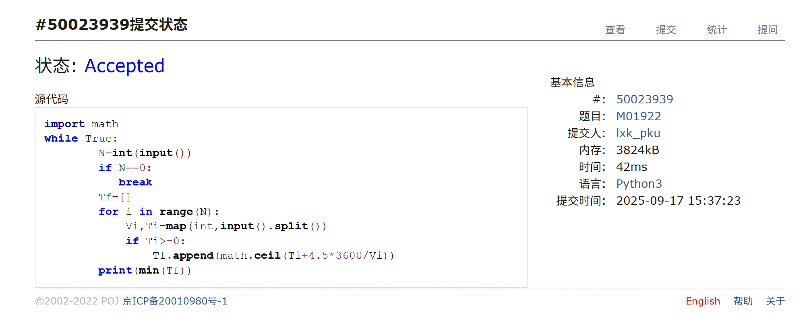

# Assignment #2: 语法练习

Updated 1335 GMT+8 Sep 16, 2025

2025 fall, Complied by <mark>物理学院 李欣珂</mark>


**作业的各项评分细则及对应的得分**

| 标准                                 | 等级                                                         | 得分 |
| ------------------------------------ | ------------------------------------------------------------ | ---- |
| 按时提交                             | 完全按时提交：1分<br/>提交有请假说明：0.5分<br/>未提交：0分  | 1 分 |
| 源码、耗时（可选）、解题思路（可选） | 提交了4个或更多题目且包含所有必要信息：1分<br/>提交了2个或以上题目但不足4个：0.5分<br/>少于2个：0分 | 1 分 |
| AC代码截图                           | 提交了4个或更多题目且包含所有必要信息：1分<br/>提交了2个或以上题目但不足4个：0.5分<br/>少于：0分 | 1 分 |
| 清晰头像、PDF文件、MD/DOC附件        | 包含清晰的Canvas头像、PDF文件以及MD或DOC格式的附件：1分<br/>缺少上述三项中的任意一项：0.5分<br/>缺失两项或以上：0分 | 1 分 |
| 学习总结和个人收获                   | 提交了学习总结和个人收获：1分<br/>未提交学习总结或内容不详：0分 | 1 分 |
| 总得分： 5                           | 总分满分：5分                                                |      |

>
>
>
>**说明：**
>
>1. **解题与记录：**
>
>   对于每一个题目，请提供其解题思路（可选），并附上使用Python或C++编写的源代码（确保已在OpenJudge， Codeforces，LeetCode等平台上获得Accepted）。请将这些信息连同显示“Accepted”的截图一起填写到下方的作业模板中。（推荐使用Typora https://typoraio.cn 进行编辑，当然你也可以选择Word。）无论题目是否已通过，请标明每个题目大致花费的时间。
>
>2. **课程平台：**课程网站位于Canvas平台（https://pku.instructure.com ）。该平台将在<mark>第2周</mark>选课结束后正式启用。在平台启用前，请先完成作业并将作业妥善保存。待Canvas平台激活后，再上传你的作业。
>
>3. **提交安排：**提交时，请首先上传PDF格式的文件，并将.md或.doc格式的文件作为附件上传至右侧的“作业评论”区。确保你的Canvas账户有一个清晰可见的本人头像，提交的文件为PDF格式，并且“作业评论”区包含上传的.md或.doc附件。
>
>4. **延迟提交：**如果你预计无法在截止日期前提交作业，请提前告知具体原因。这有助于我们了解情况并可能为你提供适当的延期或其他帮助。  
>
>请按照上述指导认真准备和提交作业，以保证顺利完成课程要求。


## 1. 题目

### 263A. Beautiful Matrix

implementation, 800, https://codeforces.com/problemset/problem/263/A


思路：本题从数学上即为起始点与中心的行数差与列数差之和，实现这一计算即可


代码

```python

c=0
for i in range(5):
    a=list(map(int,input().split()))
    if 1 in a:
        for j in range(5):
            if a[j]==1:
                c=abs(2-i)+abs(2-j)
print(c)

```


代码运行截图 <mark>（至少包含有"Accepted"）</mark>



### 1328A. Divisibility Problem

math, 800, https://codeforces.com/problemset/problem/1328/A


思路：第一次做的时候，采取了暴力枚举的方法，但是超时；最后意识到可以直接给出表达式


代码

```python
t=int(input())
num=[]
for i in range(t):
    a,b=map(int,input().split())
    k=b*(a//b+1)-a
    if k==b:
        k=0
    num.append(k)
for j in num:
    print(j)
```


代码运行截图 <mark>（至少包含有"Accepted"）</mark>



### 427A. Police Recruits

implementation, 800, https://codeforces.com/problemset/problem/427/A


思路：一开始我误解了题意，认为只需要把所有数字相加再判断正负即可，结果对着样例想了半天，最后意识到是有一个先后顺序的


代码

```python
n = int(input().strip())
a= list(map(int, input().split()))
police=0
criminal=0
for i in a:
   if i!=-1:
      police+=i
   else:
      if police>0:
         police-=1
      else:
         criminal+=1
print(criminal) 
```


代码运行截图 <mark>（至少包含有"Accepted"）</mark>



### E02808: 校门外的树

implementation, http://cs101.openjudge.cn/pctbook/E02808/


思路：这题是第一周做的，碰巧是第二周作业；当时用的是列表，现在意识到可以直接用set()


代码

```python
L,M=map(int,input().split())
length=[]
for i in range(L+1):
        length.append(i)
for i in range(M):
    a,b=map(int,input().split())
    for i in range(a,b+1):
        if i in length:
            length.remove(i)
print(len(length))

```


代码运行截图 <mark>（至少包含有"Accepted"）</mark>



### sy60: 水仙花数II

implementation, https://sunnywhy.com/sfbj/3/1/60


思路：题目数据范围很小，所以就没有想更好的算法，直接遍历了


代码

```python
a,b=map(int,input().split())
num=[]
for i in range(a,b+1):
    j=str(i)
    m,n,l=map(int,j)
    if m**3+n**3+l**3==i:
        num.append(i)
if len(num)==0:
    print('NO')
else:
    print(*num)
```


代码运行截图 <mark>（至少包含有"Accepted"）</mark>



### M01922: Ride to School

implementation, http://cs101.openjudge.cn/pctbook/M01922/


思路：一开始想了很久，后面意识到只需要将出发时间大于0的人选出来，最后选出最小的即可，于是迎刃而解


代码

```python
import math
while True:
        N=int(input())
        if N==0:
           break
        Tf=[]
        for i in range(N):
            Vi,Ti=map(int,input().split())
            if Ti>=0:
                Tf.append(math.ceil(Ti+4.5*3600/Vi))
        print(min(Tf))  
```


代码运行截图 <mark>（至少包含有"Accepted"）</mark>



## 2. 学习总结和收获
这周继续刷了oj上的E题，差不多刷了20道，也尝试了一两道M题；有一道题想了很久M01088“滑雪”，一开始想用贪心去解决，但是最后意识到是做不了的，又涉及到了其他我没接触的算法，还在学习中。


