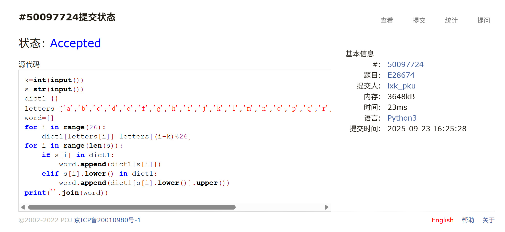
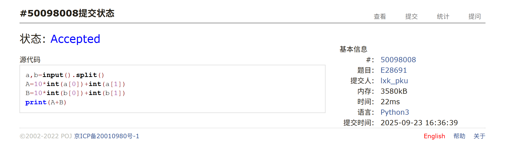
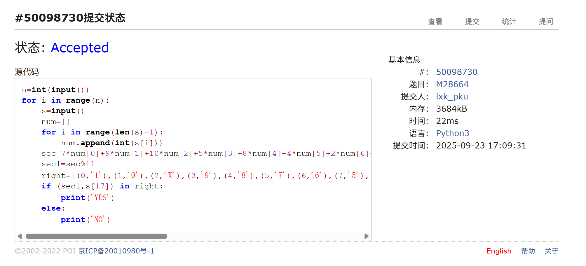
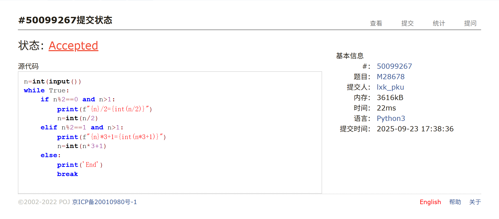
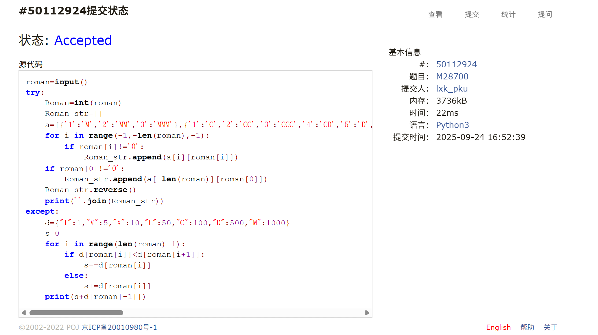
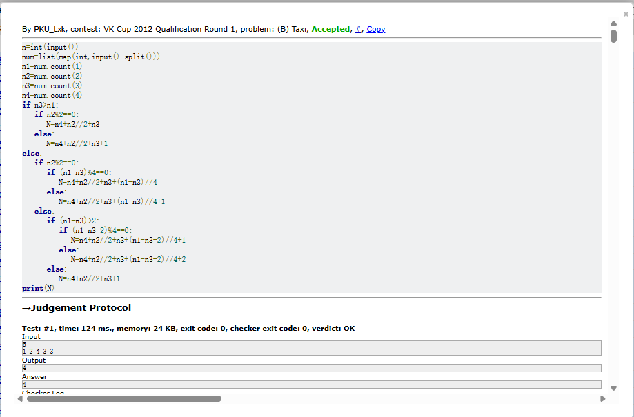

# Assignment #3: 语法练习

Updated 1440 GMT+8 Sep 23, 2025

2025 fall, Complied by <mark>物理学院 李欣珂</mark>


>**说明：**
>
>1. **解题与记录：**
>
>  对于每一个题目，请提供其解题思路（可选），并附上使用Python或C++编写的源代码（确保已在OpenJudge， Codeforces，LeetCode等平台上获得Accepted）。请将这些信息连同显示“Accepted”的截图一起填写到下方的作业模板中。（推荐使用Typora https://typoraio.cn 进行编辑，当然你也可以选择Word。）无论题目是否已通过，请标明每个题目大致花费的时间。
>
>2. 提交安排：**提交时，请首先上传PDF格式的文件，并将.md或.doc格式的文件作为附件上传至右侧的“作业评论”区。确保你的Canvas账户有一个清晰可见的本人头像，提交的文件为PDF格式，并且“作业评论”区包含上传的.md或.doc附件。
> 
>4. **延迟提交：**如果你预计无法在截止日期前提交作业，请提前告知具体原因。这有助于我们了解情况并可能为你提供适当的延期或其他帮助。  
>
>请按照上述指导认真准备和提交作业，以保证顺利完成课程要求。


## 1. 题目

### E28674:《黑神话：悟空》之加密

http://cs101.openjudge.cn/pctbook/E28674/


思路：一开始直接对字符串使用replace()，但是后面发现会重复替换造成错误，所以转而采用建立两个列表的方法


代码

```python
k=int(input())
s=str(input())
dict1={}
letters=['a','b','c','d','e','f','g','h','i','j','k','l','m','n','o','p','q','r','s','t','u','v','w','x','y','z']
word=[]
for i in range(26):
    dict1[letters[i]]=letters[(i-k)%26]
for i in range(len(s)):
    if s[i] in dict1:
        word.append(dict1[s[i]])
    elif s[i].lower() in dict1:
        word.append(dict1[s[i].lower()].upper())
print(''.join(word))

```


代码运行截图 <mark>（至少包含有"Accepted"）</mark>



### E28691: 字符串中的整数求和

http://cs101.openjudge.cn/pctbook/E28691/


思路：这题个人感觉就是纯语法题，没什么思路可言


代码

```python
a,b=input().split()
A=10*int(a[0])+int(a[1])
B=10*int(b[0])+int(b[1])
print(A+B)
```


代码运行截图 <mark>（至少包含有"Accepted"）</mark>



### M28664: 验证身份证号 

http://cs101.openjudge.cn/pctbook/M28664/


思路：我选择了比较笨的做法，直接算出余数并且使用元组比较，这一思路我认为并没有M的难度


代码

```python
n=int(input())
for i in range(n):
    s=input()
    num=[]
    for i in range(len(s)-1):
        num.append(int(s[i]))
    sec=7*num[0]+9*num[1]+10*num[2]+5*num[3]+8*num[4]+4*num[5]+2*num[6]+1*num[7]+6*num[8]+3*num[9]+7*num[10]+9*num[11]+10*num[12]+5*num[13]+8*num[14]+4*num[15]+2*num[16]
    sec1=sec%11
    right=[(0,'1'),(1,'0'),(2,'X'),(3,'9'),(4,'8'),(5,'7'),(6,'6'),(7,'5'),(8,'4'),(9,'3'),(10,'2')]
    if (sec1,s[17]) in right:
        print('YES')
    else:
        print('NO')
```


代码运行截图 <mark>（至少包含有"Accepted"）</mark>



### M28678: 角谷猜想

http://cs101.openjudge.cn/pctbook/M28678/


思路：本题个人认为也只是语法题，无非就是实现所有要求并打印，没有很清晰的思路可言


代码

```python
n=int(input())
while True:
    if n%2==0 and n>1:
        print(f"{n}/2={int(n/2)}")
        n=int(n/2)
    elif n%2==1 and n>1:
        print(f"{n}*3+1={int(n*3+1)}")
        n=int(n*3+1)
    else:
        print('End')
        break

```


代码运行截图 <mark>（至少包含有"Accepted"）</mark>



### M28700: 罗马数字与整数的转换

http://cs101.openjudge.cn/pctbook/M28700/


思路：对于罗马转阿拉伯一块，想出了比较简单的方法，直接判断字符串间大小关系并直接相加即可；对于阿拉伯转罗马一块，则采用比较笨的方法，直接把每个数字对应过去


代码

```python
roman=input()
try:                   
    Roman=int(roman)
    Roman_str=[]
    a=[{'1':'M','2':'MM','3':'MMM'},{'1':'C','2':'CC','3':'CCC','4':'CD','5':'D','6':'DC','7':'DCC','8':'DCCC','9':'CM'},{'1':'X','2':'XX','3':'XXX','4':'XL','5':'L','6':'LX','7':'LXX','8':'LXXX','9':'XC'},{'1':'I','2':'II','3':'III','4':'IV','5':'V','6':'VI','7':'VII','8':'VIII','9':'IX'}]
    for i in range(-1,-len(roman),-1):
        if roman[i]!='0':
            Roman_str.append(a[i][roman[i]])
    if roman[0]!='0':
        Roman_str.append(a[-len(roman)][roman[0]])
    Roman_str.reverse()
    print(''.join(Roman_str))
except:
    d={"I":1,"V":5,"X":10,"L":50,"C":100,"D":500,"M":1000}
    s=0
    for i in range(len(roman)-1):
        if d[roman[i]]<d[roman[i+1]]:
            s-=d[roman[i]]
        else:
            s+=d[roman[i]]
    print(s+d[roman[-1]])
```


代码运行截图 <mark>（至少包含有"Accepted"）</mark>



### 158B. Taxi

*special problem, greedy, implementation, 1100,  https://codeforces.com/problemset/problem/158/B


思路：类似于装箱，但是本人一开始用类似的思路没解出装箱，找了很久也没找清楚错误；这次对于简单一点的问题也花了不少时间，个人认为把数学表达式写出来的方法不算太好，应该在过程中建立一个变量（ai给的程序），每次操作作出对应变化更好;


代码

```python
n=int(input())
num=list(map(int,input().split()))
n1=num.count(1)
n2=num.count(2)
n3=num.count(3)
n4=num.count(4)
if n3>n1:
   if n2%2==0:
      N=n4+n2//2+n3
   else:
      N=n4+n2//2+n3+1
else:
   if n2%2==0:
      if (n1-n3)%4==0:
         N=n4+n2//2+n3+(n1-n3)//4
      else:
         N=n4+n2//2+n3+(n1-n3)//4+1
   else: 
      if (n1-n3)>2:
         if (n1-n3-2)%4==0:
            N=n4+n2//2+n3+(n1-n3-2)//4+1
         else:
            N=n4+n2//2+n3+(n1-n3-2)//4+2
      else:
         N=n4+n2//2+n3+1
print(N)
```


代码运行截图 <mark>（至少包含有"Accepted"）</mark>



## 2. 学习总结和收获
对于Taxi一题，过后我做了一下装箱，发现更简明的处理方法
```python
while True:
    N=0
    n1,n2,n3,n4,n5,n6=map(int,input().split())
    if (n1,n2,n3,n4,n5,n6)==(0,0,0,0,0,0):
        break
    #1
    n1-=11*n5
    N=n4+n5+n6
    #2
    if n2>5*n4:
        n1-=0
        n2-=5*n4
    else:
        n1-=(36-16)*n4-4*n2
        n2-=n2
    #3
    if n3%4==0:
        n1-=0
        n2-=0
        N+=n3//4
    elif n3%4==1:
        N+=n3//4+1
        if n2>5:
            n2-=5
            n1-=36-9-4*5
        else:
            n2-=n2
            n1-=36-9-4*n2
    elif n3%4==2:
        N+=n3//4+1
        if n2>3:
            n2-=3
            n1-=36-9-4*3
        else:
            n2-=n2
            n1-=36-18-4*n2
    elif n3%4==3:
        N+=n3//4+1
        if n2>1:
            n2-=1
            n1-=36-27-4*1
        else:
            n2-=n2
            n1-=36-27-4*n2
    if n1>0:
        n1-=0
    else:
        n1=0
    #4
    if (n1+4*n2)%36==0:
        N+=(n1+4*n2)//36
    else:
        N+=(n1+4*n2)//36+1
    print(N)
```
个人认为思路是清晰了很多，如果要写出数学表达式那太复杂了
除了几道M题以外，还做了几道E题（主要是M题太花时间了）；此外，还在力扣上面学习了动态规划，做了动态规划的许多经典题


