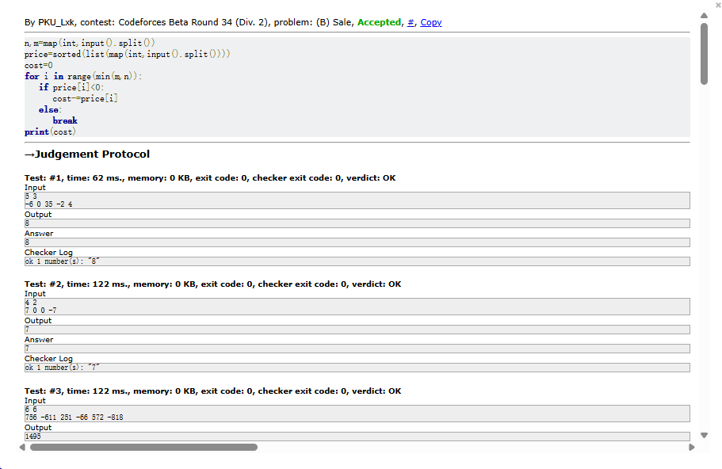
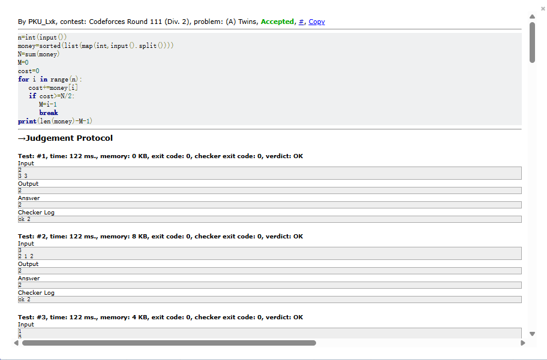
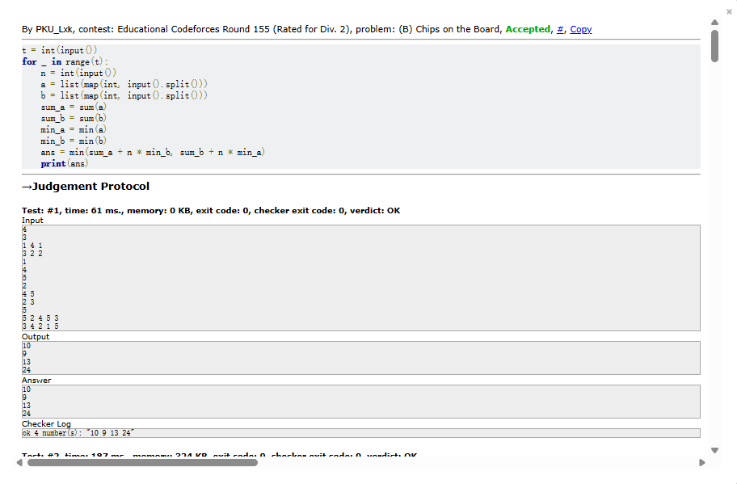
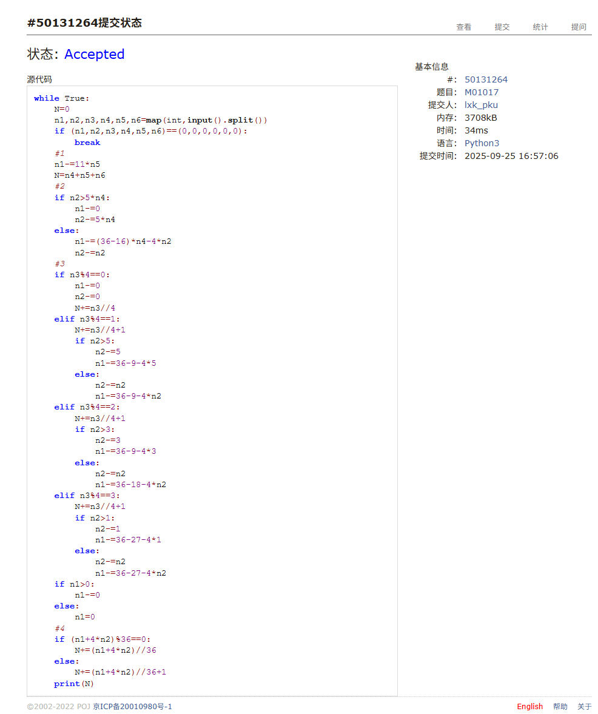
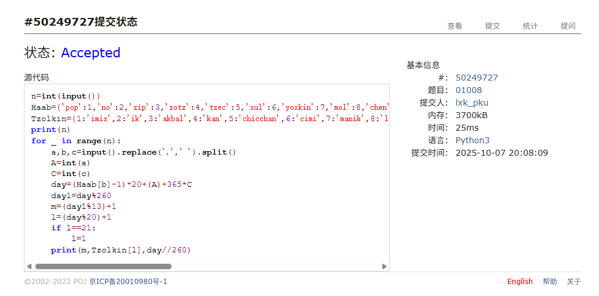
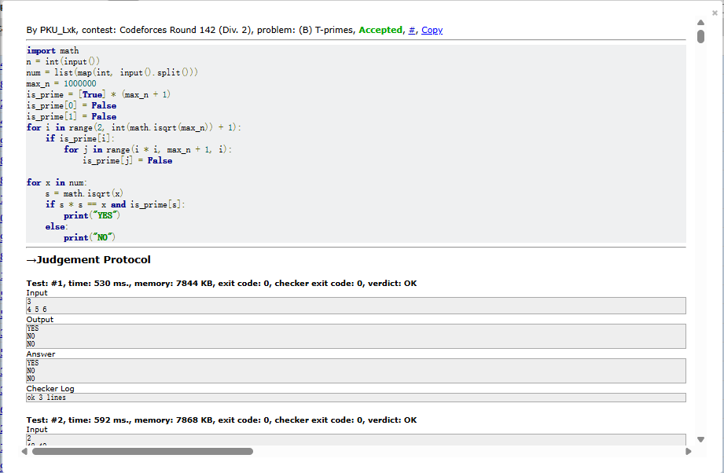

# Assignment #4: T-primes + 贪心

Updated 1814 GMT+8 Sep 30, 2025

2025 fall, Complied by <mark>李欣珂 物理学院</mark>


>**说明：**
>
>1. **解题与记录：**
>
>  对于每一个题目，请提供其解题思路（可选），并附上使用Python或C++编写的源代码（确保已在OpenJudge， Codeforces，LeetCode等平台上获得Accepted）。请将这些信息连同显示“Accepted”的截图一起填写到下方的作业模板中。（推荐使用Typora https://typoraio.cn 进行编辑，当然你也可以选择Word。）无论题目是否已通过，请标明每个题目大致花费的时间。
>
>2. 提交安排：**提交时，请首先上传PDF格式的文件，并将.md或.doc格式的文件作为附件上传至右侧的“作业评论”区。确保你的Canvas账户有一个清晰可见的本人头像，提交的文件为PDF格式，并且“作业评论”区包含上传的.md或.doc附件。
> 
>4. **延迟提交：**如果你预计无法在截止日期前提交作业，请提前告知具体原因。这有助于我们了解情况并可能为你提供适当的延期或其他帮助。  
>
>请按照上述指导认真准备和提交作业，以保证顺利完成课程要求。


## 1. 题目

### 34B. Sale

greedy, sorting, 900, https://codeforces.com/problemset/problem/34/B


思路：一开始没意识到可以不取满，可以只取负数，后面WA后才改正，本题个人认为就只需要排序完就迎刃而解了       


代码

```python
n,m=map(int,input().split())
price=sorted(list(map(int,input().split())))
cost=0
for i in range(min(m,n)):
   if price[i]<0:
      cost-=price[i]
   else:
      break
print(cost)
```


代码运行截图 <mark>（至少包含有"Accepted"）</mark>



### 160A. Twins

greedy, sortings, 900, https://codeforces.com/problemset/problem/160/A


思路：这里想到的办法是直接算出总金额并与取硬币的总额相比较，感觉还算比较笨的方法


代码

```python
n=int(input())
money=sorted(list(map(int,input().split())))
N=sum(money)
M=0
cost=0
for i in range(n):
   cost+=money[i]
   if cost>=N/2:
      M=i-1
      break
print(len(money)-M-1)
```


代码运行截图 <mark>（至少包含有"Accepted"）</mark>



### 1879B. Chips on the Board

constructive algorithms, greedy, 900, https://codeforces.com/problemset/problem/1879/B


思路：看了半天才看懂题，最后看懂了其实就是求出列表1的最小值乘n+另一个列表的和，比较两个值取最小即可


代码

```python
t = int(input())
for _ in range(t):
    n = int(input())
    a = list(map(int, input().split()))
    b = list(map(int, input().split()))
    sum_a = sum(a)
    sum_b = sum(b)
    min_a = min(a)
    min_b = min(b)
    ans = min(sum_a + n * min_b, sum_b + n * min_a)
    print(ans)
```


代码运行截图 <mark>（至少包含有"Accepted"）</mark>



### M01017: 装箱问题

greedy, http://cs101.openjudge.cn/pctbook/M01017/


思路：这道题是和上次作业一并做的，感觉思路就是在草稿纸上列出各种分类并计数，需要非常有条理的去列


代码

```python
while True:
    N=0
    n1,n2,n3,n4,n5,n6=map(int,input().split())
    if (n1,n2,n3,n4,n5,n6)==(0,0,0,0,0,0):
        break
    #1
    n1-=11*n5
    N=n4+n5+n6
    #2
    if n2>5*n4:
        n1-=0
        n2-=5*n4
    else:
        n1-=(36-16)*n4-4*n2
        n2-=n2
    #3
    if n3%4==0:
        n1-=0
        n2-=0
        N+=n3//4
    elif n3%4==1:
        N+=n3//4+1
        if n2>5:
            n2-=5
            n1-=36-9-4*5
        else:
            n2-=n2
            n1-=36-9-4*n2
    elif n3%4==2:
        N+=n3//4+1
        if n2>3:
            n2-=3
            n1-=36-9-4*3
        else:
            n2-=n2
            n1-=36-18-4*n2
    elif n3%4==3:
        N+=n3//4+1
        if n2>1:
            n2-=1
            n1-=36-27-4*1
        else:
            n2-=n2
            n1-=36-27-4*n2
    if n1>0:
        n1-=0
    else:
        n1=0
    #4
    if (n1+4*n2)%36==0:
        N+=(n1+4*n2)//36
    else:
        N+=(n1+4*n2)//36+1
    print(N)

```


代码运行截图 <mark>（至少包含有"Accepted"）</mark>



### M01008: Maya Calendar

implementation, http://cs101.openjudge.cn/practice/01008/


思路：一开始总是WA，后面检查了很久发现问题在于当day1为0时的处理。当day1为0时，应该对应Tzolkin日历的第1天，即1 imix，而不是20 ahau，修改后AC


代码

```python
n=int(input())
Haab={'pop':1,'no':2,'zip':3,'zotz':4,'tzec':5,'xul':6,'yoxkin':7,'mol':8,'chen':9,'yax':10,'zac':11,'ceh':12,'mac':13,'kankin':14,'muan':15,'pax':16,'koyab':17,'cumhu':18,'uayet':19}
Tzolkin={1:'imix',2:'ik',3:'akbal',4:'kan',5:'chicchan',6:'cimi',7:'manik',8:'lamat',9:'muluk',10:'ok',11:'chuen',12:'eb',13:'ben',14:'ix',15:'mem',16:'cib',17:'caban',18:'eznab',19:'canac',20:'ahau'}
print(n)
for _ in range(n):
    a,b,c=input().replace('.',' ').split()
    A=int(a)
    C=int(c)
    day=(Haab[b]-1)*20+(A)+365*C
    day1=day%260
    m=(day1%13)+1
    l=(day%20)+1
    if l==21:
        l=1
    print(m,Tzolkin[l],day//260)
```


代码运行截图 <mark>（至少包含有"Accepted"）</mark>



### 230B. T-primes（选做）

binary search, implementation, math, number theory, 1300, http://codeforces.com/problemset/problem/230/B


思路：一开始以为这只是个单纯的数学问题，写完第一次发现超时，学习后发现了两个思路：1.6k判断法；2.埃拉托斯特尼筛法;后者的时间复杂度要远低于前者


代码

```python
import math
n = int(input())
num = list(map(int, input().split()))
    
max_n = 1000000
is_prime = [True] * (max_n + 1)
is_prime[0] = False
is_prime[1] = False
for i in range(2, int(math.isqrt(max_n)) + 1):
    if is_prime[i]:
        for j in range(i * i, max_n + 1, i):
            is_prime[j] = False
                
for x in num:
    s = math.isqrt(x)
    if s * s == x and is_prime[s]:
        print("YES")
    else:
        print("NO")
```


代码运行截图 <mark>（至少包含有"Accepted"）</mark>



## 2. 学习总结和收获
本周花了很多时间在T-prime上，很多算法都超时，最后不得不求助ai，学习到了两种不超时判断素数的方法，但感觉还是一知半解，难以自己写出。
其余时间还是学习力扣的动态规划部分，但是刷的不多，只刷了两三题


