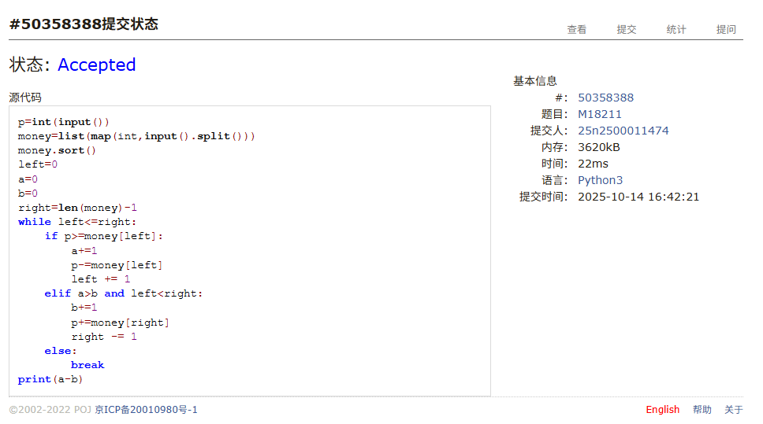
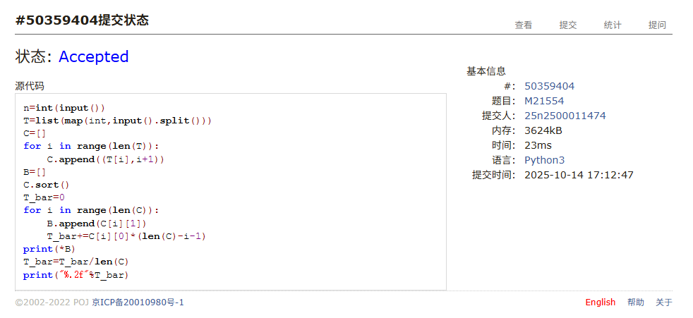
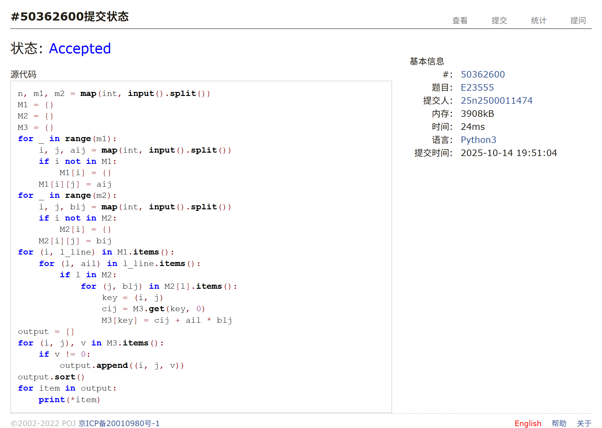
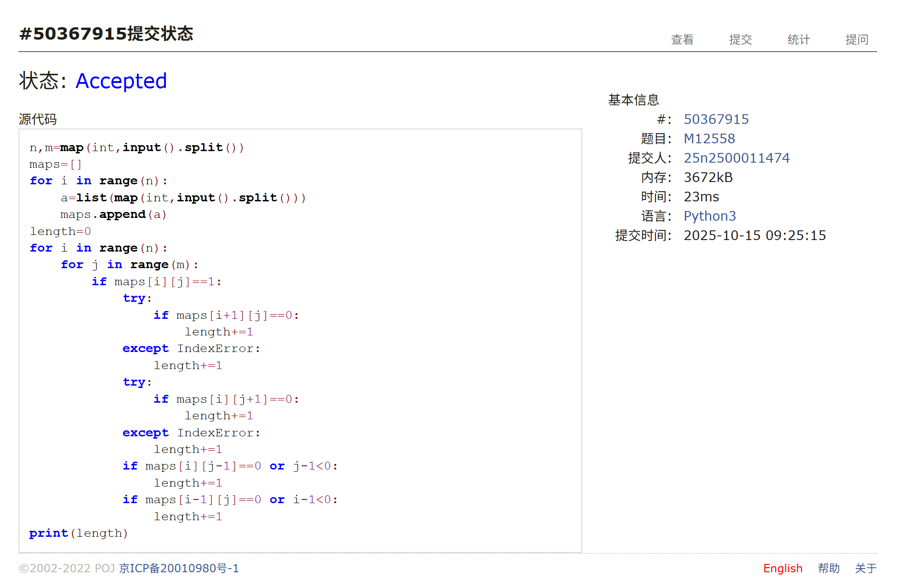
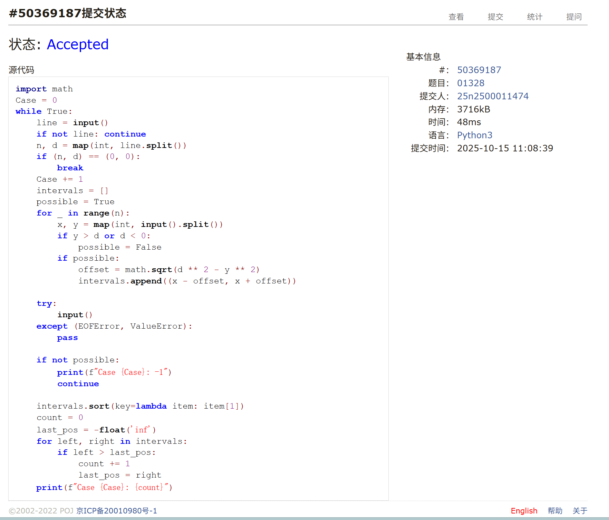
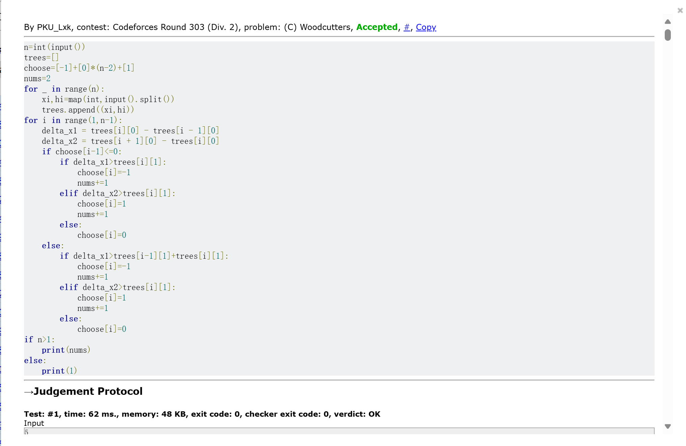

# Assignment #6: 矩阵、贪心

Updated 1432 GMT+8 Oct 14, 2025

2025 fall, Complied by <mark>同学的姓名、院系</mark>


>**说明：**
>
>1. **解题与记录：**
>
>  对于每一个题目，请提供其解题思路（可选），并附上使用Python或C++编写的源代码（确保已在OpenJudge， Codeforces，LeetCode等平台上获得Accepted）。请将这些信息连同显示“Accepted”的截图一起填写到下方的作业模板中。（推荐使用Typora https://typoraio.cn 进行编辑，当然你也可以选择Word。）无论题目是否已通过，请标明每个题目大致花费的时间。
>
>2. 提交安排：**提交时，请首先上传PDF格式的文件，并将.md或.doc格式的文件作为附件上传至右侧的“作业评论”区。确保你的Canvas账户有一个清晰可见的本人头像，提交的文件为PDF格式，并且“作业评论”区包含上传的.md或.doc附件。
> 
>4. **延迟提交：**如果你预计无法在截止日期前提交作业，请提前告知具体原因。这有助于我们了解情况并可能为你提供适当的延期或其他帮助。  
>
>请按照上述指导认真准备和提交作业，以保证顺利完成课程要求。


## 1. 题目

### M18211: 军备竞赛

greedy, two pointers, http://cs101.openjudge.cn/pctbook/M18211


思路：一开始没有很好的理解题意，以为要按照输入顺序来制作或卖出，导致根本就没有排序。后面WA后仔细读题，终于意识到贪心策略出问题了。此外，这是我第一次尝试写双指针，之前只是略有耳闻，今天第一次实践。


代码

```python
p=int(input())
money=list(map(int,input().split()))
money.sort()
left=0
a=0
b=0
right=len(money)-1
while left<=right:
    if p>=money[left]:
        a+=1
        p-=money[left]
        left += 1
    elif a>b and left<right:
        b+=1
        p+=money[right]
        right -= 1
    else:
        break
print(a-b)
```


代码运行截图 <mark>（至少包含有"Accepted"）</mark>



### M21554: 排队做实验

greedy, http://cs101.openjudge.cn/pctbook/M21554/


思路：整体贪心思路小学生应该都知道，但是第一次做的时候使用了index获取索引，但是WA。后面意识到index无法处理T相同的学生，于是改用元组。


代码

```python
n=int(input())
T=list(map(int,input().split()))
C=[]
for i in range(len(T)):
    C.append((T[i],i+1))
B=[]
C.sort()
T_bar=0
for i in range(len(C)):
    B.append(C[i][1])
    T_bar+=C[i][0]*(len(C)-i-1)
print(*B)
T_bar=T_bar/len(C)
print("%.2f"%T_bar)
```


代码运行截图 <mark>（至少包含有"Accepted"）</mark>



### E23555: 节省存储的矩阵乘法

implementation, matrices, http://cs101.openjudge.cn/pctbook/E23555


思路：（这题为啥是E？感觉想了蛮久，比M题还久）由于题目说的是节省空间，所以做的时候没有考虑时间复杂度；想办法构造了两层字典即解决


代码

```python
n, m1, m2 = map(int, input().split())
M1 = {}
M2 = {}
M3 = {}
for _ in range(m1):
    i, j, aij = map(int, input().split())
    if i not in M1:
        M1[i] = {}
    M1[i][j] = aij
for _ in range(m2):
    i, j, bij = map(int, input().split())
    if i not in M2:
        M2[i] = {}
    M2[i][j] = bij
for (i, l_line) in M1.items():
    for (l, ail) in l_line.items():
        if l in M2:
            for (j, blj) in M2[l].items():
                key = (i, j)
                cij = M3.get(key, 0)
                M3[key] = cij + ail * blj
output = []
for (i, j), v in M3.items():
    if v != 0:
        output.append((i, j, v))
output.sort()
for item in output:
    print(*item)
```


代码运行截图 <mark>（至少包含有"Accepted"）</mark>



### M12558: 岛屿周⻓

matices, http://cs101.openjudge.cn/pctbook/M12558


思路：这题交了一次就ac了。但是写的时候遇到一个点：在判断列表里面索引为0的元素时，一开始也用IndexError，但是0-1不会输出IndexError，这个错误还好在样例里面体现出来了。


代码

```python
n,m=map(int,input().split())
maps=[]
for i in range(n):
    a=list(map(int,input().split()))
    maps.append(a)
length=0
for i in range(n):
    for j in range(m):
        if maps[i][j]==1:
            try:
                if maps[i+1][j]==0:
                    length+=1
            except IndexError:
                length+=1
            try:
                if maps[i][j+1]==0:
                    length+=1
            except IndexError:
                length+=1
            if maps[i][j-1]==0 or j-1<0:
                length+=1
            if maps[i-1][j]==0 or i-1<0:
                length+=1
print(length)
```


代码运行截图 <mark>（至少包含有"Accepted"）</mark>



### M01328: Radar Installation

greedy, http://cs101.openjudge.cn/practice/01328/


思路：一开始贪心有问题，思路是：将所有岛屿按照x坐标从小到大排序，为第一个岛屿放置一个雷达，位置选在能覆盖它的最右边。然后检查下一个岛屿，如果当前雷达无法覆盖，就为这个新屿也选择一个最右边的位置放置新雷达。但是这样并不是最优，排序的依据错误了，后面求助ai才想明白，排序依据应该是需要覆盖的区间的右端点，保证每个区间都有一个雷达


代码

```python
import math
Case = 0
while True:
    line = input()
    if not line: continue
    n, d = map(int, line.split())
    if (n, d) == (0, 0):
        break
    Case += 1
    intervals = []
    possible = True
    for _ in range(n):
        x, y = map(int, input().split())
        if y > d or d < 0:
            possible = False
        if possible:
            offset = math.sqrt(d ** 2 - y ** 2)
            intervals.append((x - offset, x + offset))

    try:
        input()
    except (EOFError, ValueError):
        pass

    if not possible:
        print(f"Case {Case}: -1")
        continue

    intervals.sort(key=lambda item: item[1])
    count = 0
    last_pos = -float('inf')
    for left, right in intervals:
        if left > last_pos:
            count += 1
            last_pos = right
    print(f"Case {Case}: {count}")
```


代码运行截图 <mark>（至少包含有"Accepted"）</mark>



### 545C. Woodcutters

dp, greedy, 1500, https://codeforces.com/problemset/problem/545/C


思路：贪心可以非常容易解决，但是由于边界n=1没有考虑，第一次没能ac


代码

```python
n=int(input())
trees=[]
choose=[-1]+[0]*(n-2)+[1]
nums=2
for _ in range(n):
    xi,hi=map(int,input().split())
    trees.append((xi,hi))
for i in range(1,n-1):
    delta_x1 = trees[i][0] - trees[i - 1][0]
    delta_x2 = trees[i + 1][0] - trees[i][0]
    if choose[i-1]<=0:
        if delta_x1>trees[i][1]:
            choose[i]=-1
            nums+=1
        elif delta_x2>trees[i][1]:
            choose[i]=1
            nums+=1
        else:
            choose[i]=0
    else:
        if delta_x1>trees[i-1][1]+trees[i][1]:
            choose[i]=-1
            nums+=1
        elif delta_x2>trees[i][1]:
            choose[i]=1
            nums+=1
        else:
            choose[i]=0
if n>1:
    print(nums)
else:
    print(1)
```


代码运行截图 <mark>（至少包含有"Accepted"）</mark>



## 2. 学习总结和收获
这周依然在刷力扣上面的题，继续学习dp的矩阵等，还刷了一点热题，同时完成讲义上贪心的练习题也花费了不少时间


