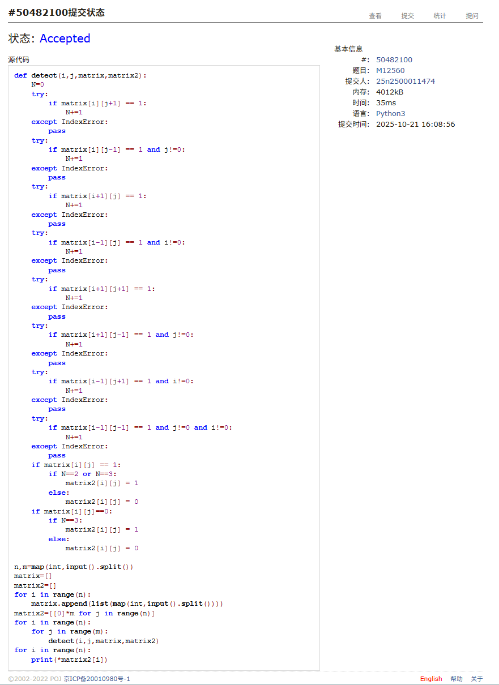
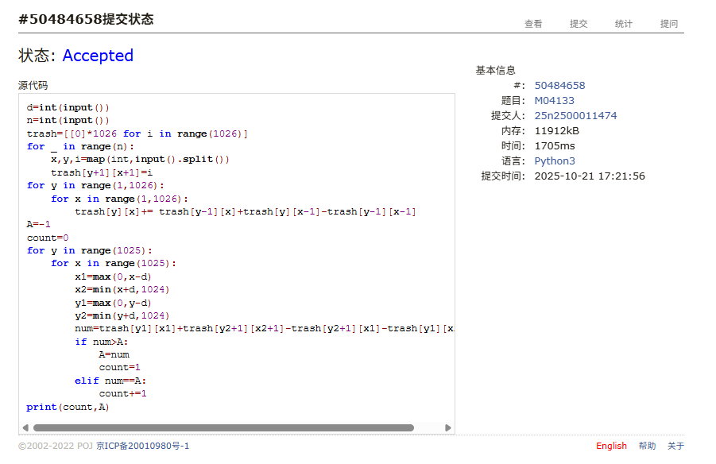
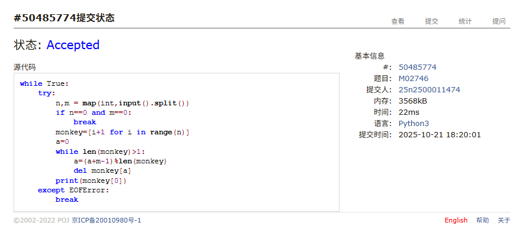
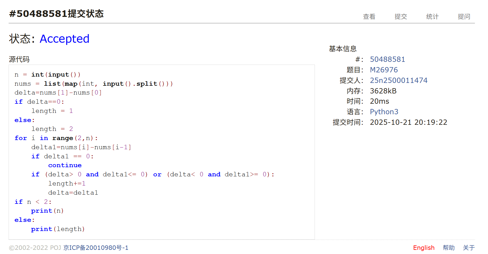
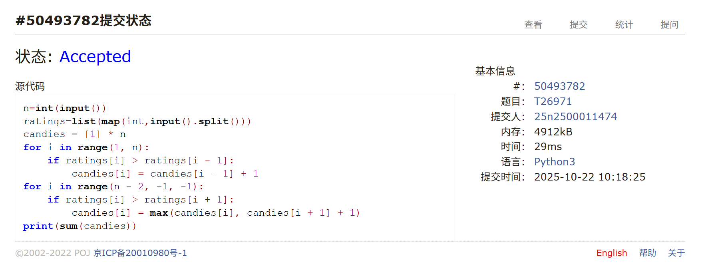
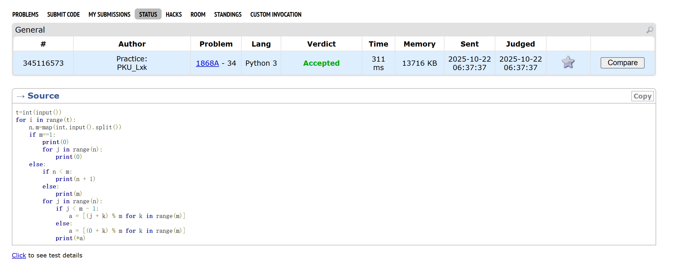

# Assignment #7: 矩阵、队列、贪心

Updated 1315 GMT+8 Oct 21, 2025

2025 fall, Complied by <mark>同学的姓名、院系</mark>


>**说明：**
>
>1. **解题与记录：**
>
>  对于每一个题目，请提供其解题思路（可选），并附上使用Python或C++编写的源代码（确保已在OpenJudge， Codeforces，LeetCode等平台上获得Accepted）。请将这些信息连同显示“Accepted”的截图一起填写到下方的作业模板中。（推荐使用Typora https://typoraio.cn 进行编辑，当然你也可以选择Word。）无论题目是否已通过，请标明每个题目大致花费的时间。
>
>2. 提交安排：**提交时，请首先上传PDF格式的文件，并将.md或.doc格式的文件作为附件上传至右侧的“作业评论”区。确保你的Canvas账户有一个清晰可见的本人头像，提交的文件为PDF格式，并且“作业评论”区包含上传的.md或.doc附件。
> 
>4. **延迟提交：**如果你预计无法在截止日期前提交作业，请提前告知具体原因。这有助于我们了解情况并可能为你提供适当的延期或其他帮助。  
>
>请按照上述指导认真准备和提交作业，以保证顺利完成课程要求。


## 1. 题目

### M12560: 生存游戏

matrices, http://cs101.openjudge.cn/pctbook/M12560/

思路：写的代码非常臃肿且很多无效部分，思路就是简单直接的计算每个单元附近活细菌数。


代码

```python
def detect(i,j,matrix,matrix2):
    N=0
    try:
        if matrix[i][j+1] == 1:
            N+=1
    except IndexError:
        pass
    try:
        if matrix[i][j-1] == 1 and j!=0:
            N+=1
    except IndexError:
        pass
    try:
        if matrix[i+1][j] == 1:
            N+=1
    except IndexError:
        pass
    try:
        if matrix[i-1][j] == 1 and i!=0:
            N+=1
    except IndexError:
        pass
    try:
        if matrix[i+1][j+1] == 1:
            N+=1
    except IndexError:
        pass
    try:
        if matrix[i+1][j-1] == 1 and j!=0:
            N+=1
    except IndexError:
        pass
    try:
        if matrix[i-1][j+1] == 1 and i!=0:
            N+=1
    except IndexError:
        pass
    try:
        if matrix[i-1][j-1] == 1 and j!=0 and i!=0:
            N+=1
    except IndexError:
        pass
    if matrix[i][j] == 1:
        if N==2 or N==3:
            matrix2[i][j] = 1
        else:
            matrix2[i][j] = 0
    if matrix[i][j]==0:
        if N==3:
            matrix2[i][j] = 1
        else:
            matrix2[i][j] = 0

n,m=map(int,input().split())
matrix=[]
matrix2=[]
for i in range(n):
    matrix.append(list(map(int,input().split())))
matrix2=[[0]*m for j in range(n)]
for i in range(n):
    for j in range(m):
        detect(i,j,matrix,matrix2)
for i in range(n):
    print(*matrix2[i])

```


代码运行截图 <mark>（至少包含有"Accepted"）</mark>



### M04133:垃圾炸弹

matrices, http://cs101.openjudge.cn/pctbook/M04133/

思路：一开始超时，后面采用的优化方式是先计算出以（0，0）、（x，y）为端点的矩形内的垃圾数，然后在通过计算投放区域四个端点的垃圾数来得到结果（前缀和？）


代码

```python
d=int(input())
n=int(input())
trash=[[0]*1026 for i in range(1026)]
for _ in range(n):
    x,y,i=map(int,input().split())
    trash[y+1][x+1]=i
for y in range(1,1026):
    for x in range(1,1026):
        trash[y][x]+= trash[y-1][x]+trash[y][x-1]-trash[y-1][x-1]
A=-1
count=0
for y in range(1025):
    for x in range(1025):
        x1=max(0,x-d)
        x2=min(x+d,1024)
        y1=max(0,y-d)
        y2=min(y+d,1024)
        num=trash[y1][x1]+trash[y2+1][x2+1]-trash[y2+1][x1]-trash[y1][x2+1]
        if num>A:
            A=num
            count=1
        elif num==A:
            count+=1
print(count,A)
```


代码运行截图 <mark>（至少包含有"Accepted"）</mark>



### M02746: 约瑟夫问题

implementation, queue, http://cs101.openjudge.cn/pctbook/M02746/

思路：一开始没注意到“接着数”，改正后轻易ac


代码

```python
while True:
    try:
        n,m = map(int,input().split())
        if n==0 and m==0:
            break
        monkey=[i+1 for i in range(n)]
        a=0
        while len(monkey)>1:
            a=(a+m-1)%len(monkey)
            del monkey[a]
        print(monkey[0])
    except EOFError:
        break
```


代码运行截图 <mark>（至少包含有"Accepted"）</mark>



### M26976:摆动序列

greedy, http://cs101.openjudge.cn/pctbook/M26976/


思路：本题在特殊情况卡了很久，主要集中在两个数的差为0情况：循环中我一开始误用了delta==0的条件使得在某些情况下无法跳出循环继续处理。


代码

```python
n = int(input())
nums = list(map(int, input().split()))
delta=nums[1]-nums[0]
if delta==0:
    length = 1
else:
    length = 2
for i in range(2,n):
    delta1=nums[i]-nums[i-1]
    if delta1 == 0:
        continue
    if (delta> 0 and delta1<= 0) or (delta< 0 and delta1>= 0):
        length+=1
        delta=delta1
if n < 2:
    print(n)
else:
    print(length)
```


代码运行截图 <mark>（至少包含有"Accepted"）</mark>



### T26971:分发糖果

greedy, http://cs101.openjudge.cn/pctbook/T26971/

思路：一开始尝试思考单向遍历，思考了很久，发现很难处理降序的情况。于是想到了双向遍历，这样不管是升序降序都可以用升序处理，容易很多


代码

```python
n=int(input())
ratings=list(map(int,input().split()))
candies = [1] * n
for i in range(1, n):
    if ratings[i] > ratings[i - 1]:
        candies[i] = candies[i - 1] + 1
for i in range(n - 2, -1, -1):
    if ratings[i] > ratings[i + 1]:
        candies[i] = max(candies[i], candies[i + 1] + 1)
print(sum(candies))

```


代码运行截图 <mark>（至少包含有"Accepted"）</mark>



### 1868A. Fill in the Matrix

constructive algorithms, implementation, 1300, https://codeforces.com/problemset/problem/1868/A

思路：这题直接干瞪眼想出构造方法即可：直接每一行错位就行。


代码

```python
t=int(input())
for i in range(t):
    n,m=map(int,input().split())
    if m==1:
        print(0)
        for j in range(n):
            print(0)
    else:
        if n < m:
            print(n + 1)
        else:
            print(m)
        for j in range(n):
            if j < m - 1:
                a = [(j + k) % m for k in range(m)]
            else:
                a = [(0 + k) % m for k in range(m)]
            print(*a)
```


代码运行截图 <mark>（至少包含有"Accepted"）</mark>



## 2. 学习总结和收获
刷力扣的时候发现了一个叫前缀和的算法，发现M04133刚好就是二维前缀和。
这周开始系统学习力扣上的各个部分，从数组和字符串开始。（由于期中临近且计概没有期中考，进度有所放缓，且发现有的内容要访问需要vip……）


