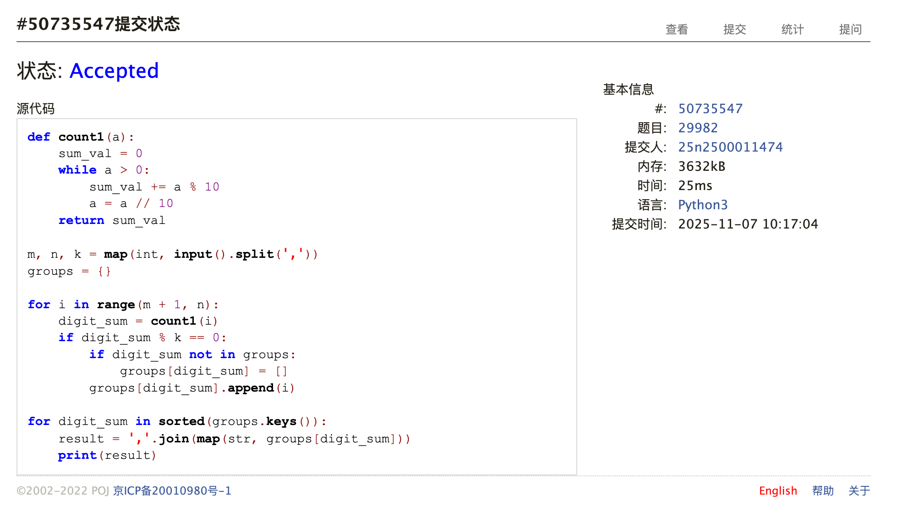
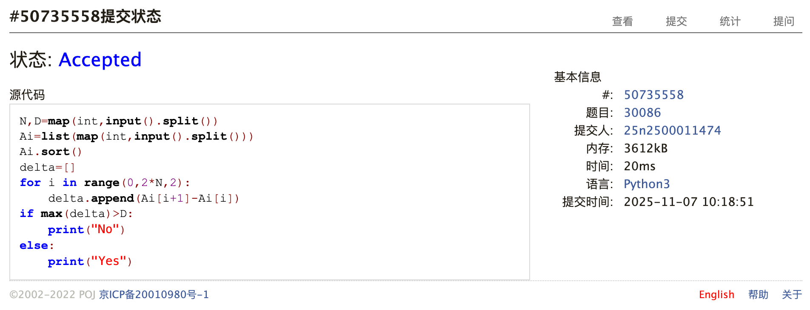
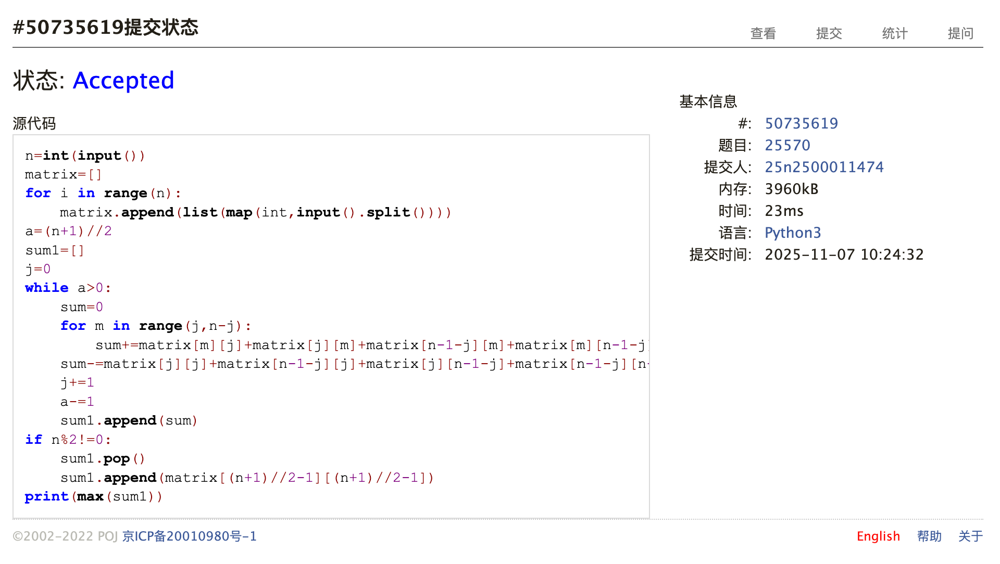
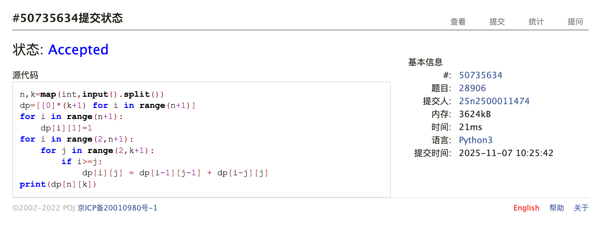
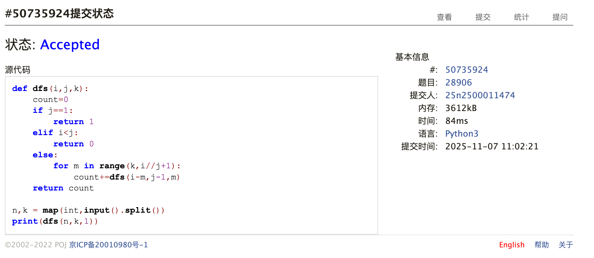
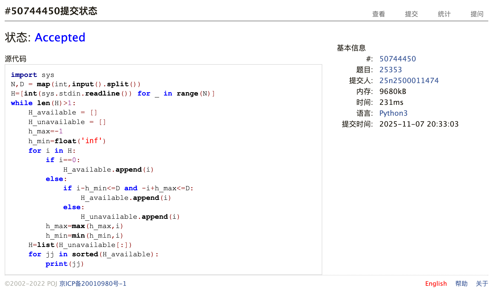

# Assignment #9: Mock Exam立冬前一天

Updated 1658 GMT+8 Nov 6, 2025

2025 fall, Complied by <mark>同学的姓名、院系</mark>


>**说明：**
>
>1. Nov⽉考： AC6<mark>（请改为同学的通过数）</mark> 。考试题⽬都在“题库（包括计概、数算题目）”⾥⾯，按照数字题号能找到，可以重新提交。作业中提交⾃⼰最满意版本的代码和截图。
>
>2. 解题与记录：对于每一个题目，请提供其解题思路（可选），并附上使用Python或C++编写的源代码（确保已在OpenJudge， Codeforces，LeetCode等平台上获得Accepted）。请将这些信息连同显示“Accepted”的截图一起填写到下方的作业模板中。（推荐使用Typora https://typoraio.cn 进行编辑，当然你也可以选择Word。）无论题目是否已通过，请标明每个题目大致花费的时间。
>
>3. 提交安排：提交时，请首先上传PDF格式的文件，并将.md或.doc格式的文件作为附件上传至右侧的“作业评论”区。确保你的Canvas账户有一个清晰可见的本人头像，提交的文件为PDF格式，并且“作业评论”区包含上传的.md或.doc附件。
> 
>4. 延迟提交：如果你预计无法在截止日期前提交作业，请提前告知具体原因。这有助于我们了解情况并可能为你提供适当的延期或其他帮助。  
>
>请按照上述指导认真准备和提交作业，以保证顺利完成课程要求。


## 1. 题目

### E29982:一种等价类划分问题

hashing, http://cs101.openjudge.cn/practice/29982

思路：感觉这题确实就是语法题，在输出格式上捣鼓了很久，除此之外没有特别难的点。


代码

```python
def count1(a):
    sum_val = 0
    while a > 0:
        sum_val += a % 10
        a = a // 10
    return sum_val

m, n, k = map(int, input().split(','))
groups = {}

for i in range(m + 1, n):
    digit_sum = count1(i)
    if digit_sum % k == 0:
        if digit_sum not in groups:
            groups[digit_sum] = []
        groups[digit_sum].append(i)

for digit_sum in sorted(groups.keys()):
    result = ','.join(map(str, groups[digit_sum]))
    print(result)
```


代码运行截图 <mark>（至少包含有"Accepted"）</mark>



### E30086:dance

greedy, http://cs101.openjudge.cn/practice/30086

思路：这题思路不难，交了一次就过了。把示例排一下序就看出端倪了，示例还特意调换了一下顺序，实际上排序后让相邻的能配对就行了。


代码

```python
N,D=map(int,input().split())
Ai=list(map(int,input().split()))
Ai.sort()
delta=[]
for i in range(0,2*N,2):
    delta.append(Ai[i+1]-Ai[i])
if max(delta)>D:
    print("No")
else:
    print("Yes")
```


代码运行截图 <mark>（至少包含有"Accepted"）</mark>



### M25570: 洋葱

matrices, http://cs101.openjudge.cn/practice/25570

思路：这题用了很笨的方法，并且笨拙地修补了一下，满足了题目的要求，还好一次就过了。


代码

```python
n=int(input())
matrix=[]
for i in range(n):
    matrix.append(list(map(int,input().split())))
a=(n+1)//2
sum1=[]
j=0
while a>0:
    sum=0
    for m in range(j,n-j):
        sum+=matrix[m][j]+matrix[j][m]+matrix[n-1-j][m]+matrix[m][n-1-j]
    sum-=matrix[j][j]+matrix[n-1-j][j]+matrix[j][n-1-j]+matrix[n-1-j][n-1-j]
    j+=1
    a-=1
    sum1.append(sum)
if n%2!=0:
    sum1.pop()
    sum1.append(matrix[(n+1)//2-1][(n+1)//2-1])
print(max(sum1))
```


代码运行截图 <mark>（至少包含有"Accepted"）</mark>



### M28906:数的划分

dfs, dp, http://cs101.openjudge.cn/practice/28906


思路：还好提示了dp，不然可能想不到用dp做，但是一提示以后发现dp思路很简单，就果断用了dp，考试后写了dfs。明显发现dp比dfs快不少。
```python
def dfs(i,j,k):
    count=0
    if j==1:
        return 1
    elif i<j:
        return 0
    else:
        for m in range(k,i//j+1):
            count+=dfs(i-m,j-1,m)
    return count

n,k = map(int,input().split())
print(dfs(n,k,1))
```


代码

```python
n,k=map(int,input().split())
dp=[[0]*(k+1) for i in range(n+1)]
for i in range(n+1):
    dp[i][1]=1
for i in range(2,n+1):
    for j in range(2,k+1):
        if i>=j:
            dp[i][j] = dp[i-1][j-1] + dp[i-j][j]
print(dp[n][k])
```


代码运行截图 <mark>（至少包含有"Accepted"）</mark>




### M29896:购物

greedy, http://cs101.openjudge.cn/practice/29896

思路：感觉这题贪心思路看似不难，但其实很难想。思路在于，我们根据目前覆盖的面值范围，选取小于这一面值范围内的最大硬币，才能保证覆盖新的面值范围内所有面值，同时最大化增大范围。


代码

```python
X,N=map(int,input().split())
val=sorted(map(int,input().split()))
if val[0]!=1:
    print(-1)
else:
    num = 0
    max_val = 0
    while max_val<X:
        add=0
        for x in reversed(val):
            if x<=max_val+1:
                add=x
                break
        max_val+=add
        num+=1
print(num)
```


代码运行截图 <mark>（至少包含有"Accepted"）</mark>


### T25353:排队

greedy, http://cs101.openjudge.cn/practice/25353

思路：与超时搏斗了很久。基本思路是找出某一个能一路移到最左边的h，对于所有h，只需要从小到大移就可以了。不过时间复杂度方面，一开始写了$N^3$算法，后面使用判断最大最小值的方法避免了一次循环到了$N^2$，然后本来使用了remove更新列表H，后面意识到也很慢，重新建立了一个表，二者综合才过。


代码

```python
import sys
N,D = map(int,input().split())
H=[int(sys.stdin.readline()) for _ in range(N)]
while len(H)>1:
    H_available = []
    H_unavailable = []
    h_max=-1
    h_min=float('inf')
    for i in H:
        if i==0:
            H_available.append(i)
        else:
            if i-h_min<=D and -i+h_max<=D:
                H_available.append(i)
            else:
                H_unavailable.append(i)
        h_max=max(h_max,i)
        h_min=min(h_min,i)
    H=list(H_unavailable[:])
    for jj in sorted(H_available):
        print(jj)

```


代码运行截图 <mark>（至少包含有"Accepted"）</mark>



## 2. 学习总结和收获
本次月考还是ac4，感觉后两题非常无力，本来打算冲ac5，但是第五题做了半小时没做出来。之后还是要勤加练习（不过感觉贪心题不太有章法？没想到很好的训练手段）。不过比较好的是这次考试至少没有因为非智力因素导致题目做不出来。


