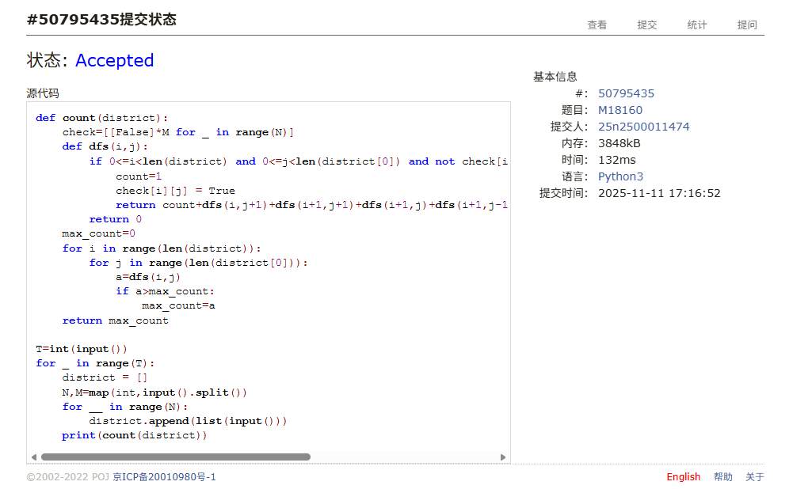
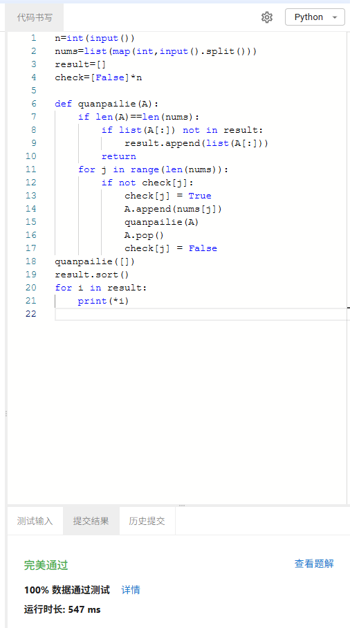
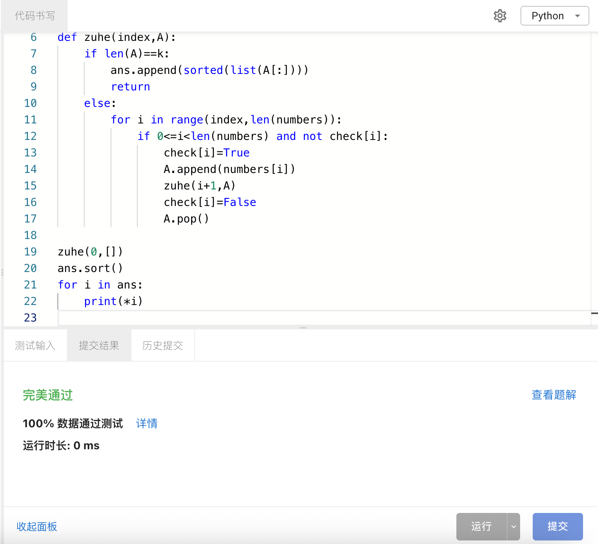
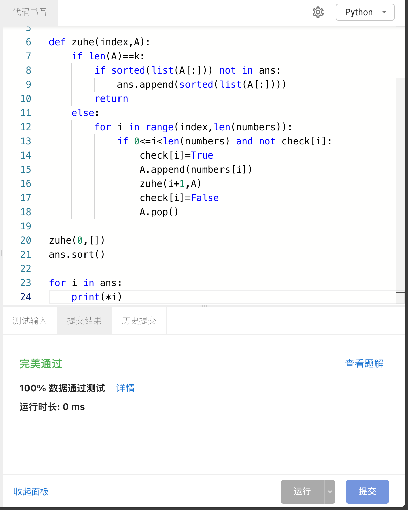
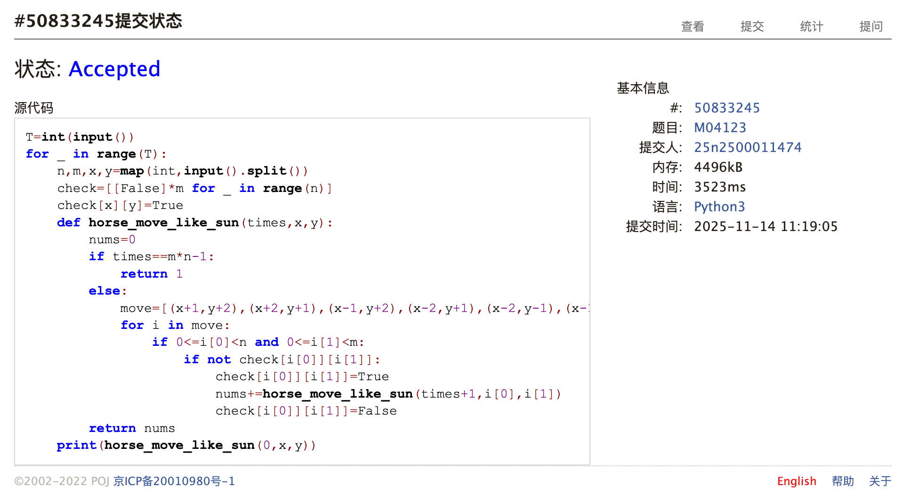
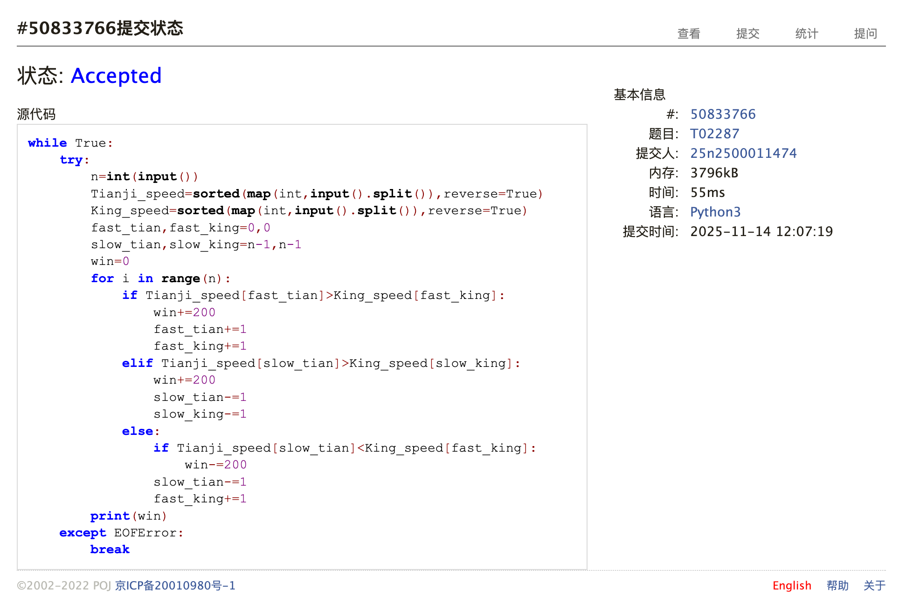

# Assignment #A: 递归、田忌赛马

Updated 2355 GMT+8 Nov 4, 2025

2025 fall, Complied by <mark>李欣珂 物理学院</mark>


>**说明：**
>
>1. **解题与记录：**
>
>  对于每一个题目，请提供其解题思路（可选），并附上使用Python或C++编写的源代码（确保已在OpenJudge， Codeforces，LeetCode等平台上获得Accepted）。请将这些信息连同显示“Accepted”的截图一起填写到下方的作业模板中。（推荐使用Typora https://typoraio.cn 进行编辑，当然你也可以选择Word。）无论题目是否已通过，请标明每个题目大致花费的时间。
>
>2. 提交安排：**提交时，请首先上传PDF格式的文件，并将.md或.doc格式的文件作为附件上传至右侧的“作业评论”区。确保你的Canvas账户有一个清晰可见的本人头像，提交的文件为PDF格式，并且“作业评论”区包含上传的.md或.doc附件。
> 
>4. **延迟提交：**如果你预计无法在截止日期前提交作业，请提前告知具体原因。这有助于我们了解情况并可能为你提供适当的延期或其他帮助。  
>
>请按照上述指导认真准备和提交作业，以保证顺利完成课程要求。


## 1. 题目

### M018160: 最大连通域面积

dfs similar, http://cs101.openjudge.cn/pctbook/M18160

思路：dfs的问题思路上没有什么阻碍了，但是经常在何处引入变量、列表这一点去纠结，这一点我会想很久


代码

```python
def count(district):
    check=[[False]*M for _ in range(N)]
    def dfs(i,j):
        if 0<=i<len(district) and 0<=j<len(district[0]) and not check[i][j] and district[i][j]=='W':
            count=1
            check[i][j] = True
            return count+dfs(i,j+1)+dfs(i+1,j+1)+dfs(i+1,j)+dfs(i+1,j-1)+dfs(i,j-1)+dfs(i-1,j-1)+dfs(i-1,j)+dfs(i-1,j+1)
        return 0
    max_count=0
    for i in range(len(district)):
        for j in range(len(district[0])):
            a=dfs(i,j)
            if a>max_count:
                max_count=a
    return max_count

T=int(input())
for _ in range(T):
    district = []
    N,M=map(int,input().split())
    for __ in range(N):
        district.append(list(input()))
    print(count(district))
```


代码运行截图 <mark>（至少包含有"Accepted"）</mark>



### sy134: 全排列III 中等

https://sunnywhy.com/sfbj/4/3/134

思路：基本和经典的全排列一模一样，只需要简单加一个去重就可以了


代码

```python
n=int(input())
nums=list(map(int,input().split()))
result=[]
check=[False]*n

def quanpailie(A):
    if len(A)==len(nums):
        if list(A[:]) not in result:
            result.append(list(A[:]))
        return
    for j in range(len(nums)):
        if not check[j]:
            check[j] = True
            A.append(nums[j])
            quanpailie(A)
            A.pop()
            check[j] = False
quanpailie([])
result.sort()
for i in result:
    print(*i)

```


代码运行截图 <mark>（至少包含有"Accepted"）</mark>



### sy136: 组合II 中等

https://sunnywhy.com/sfbj/4/3/136

给定一个长度为的序列，其中有n个互不相同的正整数，再给定一个正整数k，求从序列中任选k个的所有可能结果。

思路：一开始采取的去重策略是在递归的终止条件中加上一个检索，但是这样每次都要遍历列表，导致超时。最后选择了每次递归的时候把范围都缩小到列表后面的数以实现去重。


代码

```python
n,k=map(int,input().split())
numbers=list(map(int,input().split()))
ans=[]
check=[False]*n

def zuhe(index,A):
    if len(A)==k:
        ans.append(sorted(list(A[:])))
        return
    else:
        for i in range(index,len(numbers)):
            if 0<=i<len(numbers) and not check[i]:
                check[i]=True
                A.append(numbers[i])
                zuhe(i+1,A)
                check[i]=False
                A.pop()

zuhe(0,[])
ans.sort()
for i in ans:
    print(*i)

```


代码运行截图 <mark>（至少包含有"Accepted"）</mark>



### sy137: 组合III 中等

https://sunnywhy.com/sfbj/4/3/137


思路：这题和上题的区别无非在于重复的元素会使上一问的去重失效，发现这题使用上一问的超时的思路能过（）不过在递归的时候检索一下元素大小再跳过也可以实现


代码

```python
n,k=map(int,input().split())
numbers=list(map(int,input().split()))
ans=[]
check=[False]*n

def zuhe(index,A):
    if len(A)==k:
        if sorted(list(A[:])) not in ans:
            ans.append(sorted(list(A[:])))
        return
    else:
        for i in range(index,len(numbers)):
            if 0<=i<len(numbers) and not check[i]:
                check[i]=True
                A.append(numbers[i])
                zuhe(i+1,A)
                check[i]=False
                A.pop()

zuhe(0,[])
ans.sort()

for i in ans:
    print(*i)
```


代码运行截图 <mark>（至少包含有"Accepted"）</mark>



### M04123: 马走日

dfs, http://cs101.openjudge.cn/pctbook/M04123

思路：感觉是很简单的dfs，除了一开始x和y与m和n的对应关系搞反了被硬控了很久


代码

```python
T=int(input())
for _ in range(T):
    n,m,x,y=map(int,input().split())
    check=[[False]*m for _ in range(n)]
    check[x][y]=True
    def horse_move_like_sun(times,x,y):
        nums=0
        if times==m*n-1:
            return 1
        else:
            move=[(x+1,y+2),(x+2,y+1),(x-1,y+2),(x-2,y+1),(x-2,y-1),(x-1,y-2),(x+1,y-2),(x+2,y-1)]
            for i in move:
                if 0<=i[0]<n and 0<=i[1]<m:
                    if not check[i[0]][i[1]]:
                        check[i[0]][i[1]]=True
                        nums+=horse_move_like_sun(times+1,i[0],i[1])
                        check[i[0]][i[1]]=False
        return nums
    print(horse_move_like_sun(0,x,y))
```


代码运行截图 <mark>（至少包含有"Accepted"）</mark>



### T02287: Tian Ji -- The Horse Racing

greedy, dfs http://cs101.openjudge.cn/pctbook/T02287

思路：刚好做了几题双指针，感觉这题有点类似双指针，贪心思路就是：先看上等马能不能赢，不能赢就看下等马能不能赢，赢不了就用下等马去输就好了


代码

```python
while True:
    try:
        n=int(input())
        Tianji_speed=sorted(map(int,input().split()),reverse=True)
        King_speed=sorted(map(int,input().split()),reverse=True)
        fast_tian,fast_king=0,0
        slow_tian,slow_king=n-1,n-1
        win=0
        for i in range(n):
            if Tianji_speed[fast_tian]>King_speed[fast_king]:
                win+=200
                fast_tian+=1
                fast_king+=1
            elif Tianji_speed[slow_tian]>King_speed[slow_king]:
                win+=200
                slow_tian-=1
                slow_king-=1
            else:
                if Tianji_speed[slow_tian]<King_speed[fast_king]:
                    win-=200
                slow_tian-=1
                fast_king+=1
        print(win)
    except EOFError:
        break
```


代码运行截图 <mark>（至少包含有"Accepted"）</mark>



## 2. 学习总结和收获
这周作业感觉更熟练了（不过也有可能是题目的模板性比较强），本周继续系统的把讲义消化一下，为期末的cheet sheet做准备。


