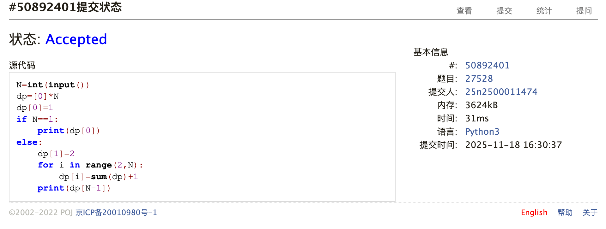
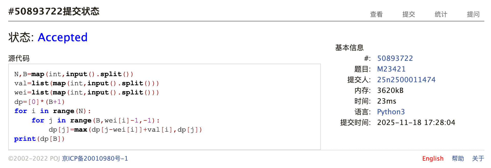
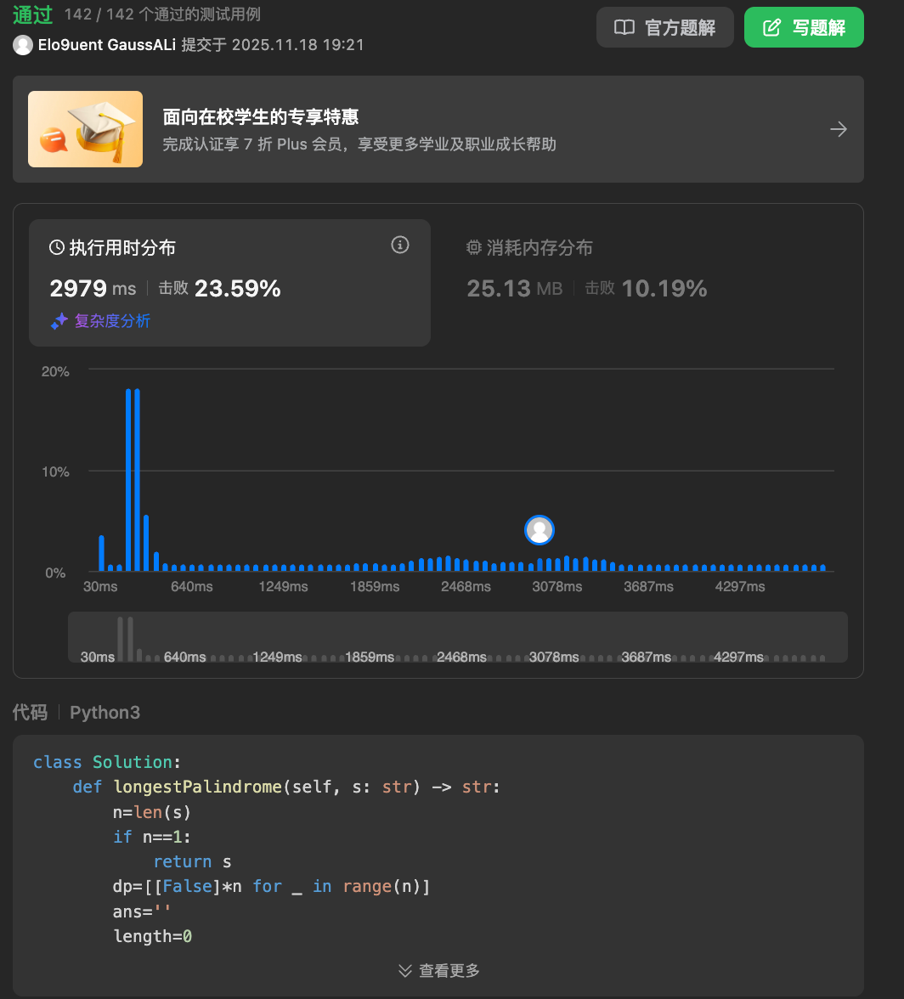
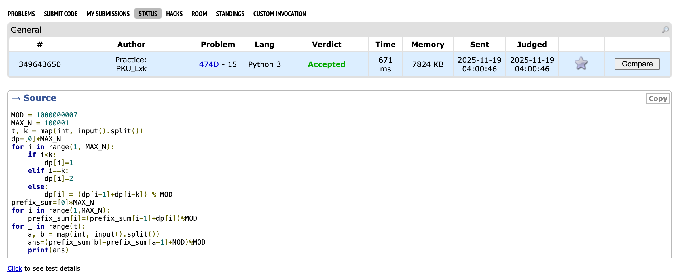
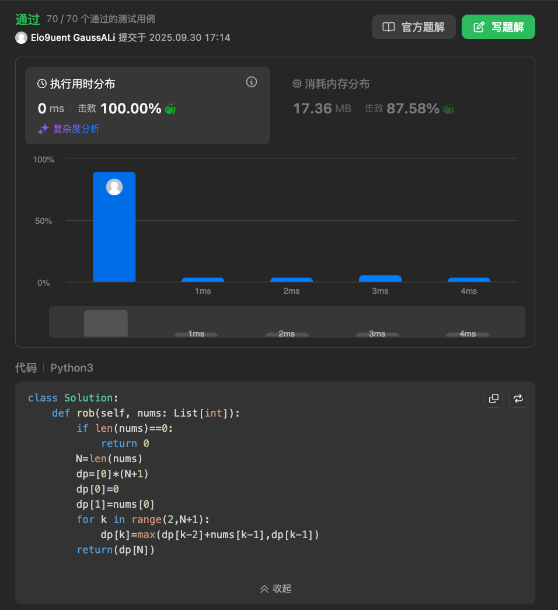

# Assignment #B: dp

Updated 1448 GMT+8 Nov 18, 2025

2025 fall, Complied by <mark>物理学院 李欣珂</mark>


**说明：**

1）请把每个题目解题思路（可选），源码Python, 或者C++（已经在Codeforces/Openjudge上AC），截图（包含Accepted），填写到下面作业模版中（推荐使用 typora https://typoraio.cn ，或者用word）。AC 或者没有AC，都请标上每个题目大致花费时间。

2）提交时候先提交pdf文件，再把md或者doc文件上传到右侧“作业评论”。Canvas需要有同学清晰头像、提交文件有pdf、"作业评论"区有上传的md或者doc附件。

3）如果不能在截止前提交作业，请写明原因。


## 1. 题目

### LuoguP1255 数楼梯

dp, bfs, https://www.luogu.com.cn/problem/P1255

思路：这题应该是最最最简单的dp，只需要注意一下边界就没有任何难度


代码：

```python
N=int(input())
dp=[0]*N
dp[0]=1
if N==1:
    print(dp[0])
else:
    dp[1]=2
    for i in range(2,N):
        dp[i]=dp[i-1]+dp[i-2]
    print(dp[N-1])
```


代码运行截图 <mark>（至少包含有"Accepted"）</mark>


### 27528: 跳台阶

dp, http://cs101.openjudge.cn/practice/27528/

思路：这题思路和上题基本没有区别


代码：

```python
N=int(input())
dp=[0]*N
dp[0]=1
if N==1:
    print(dp[0])
else:
    dp[1]=2
    for i in range(2,N):
        dp[i]=sum(dp)+1
    print(dp[N-1])
```


代码运行截图 <mark>（至少包含有"Accepted"）</mark>



### M23421:《算法图解》小偷背包问题

dp, http://cs101.openjudge.cn/pctbook/M23421/

思路：这题思路好想，写出来有点绕？先遍历所有物品，再对可能放下物品的dp[j]进行判断是否要放


代码：

```python
N,B=map(int,input().split())
val=list(map(int,input().split()))
wei=list(map(int,input().split()))
dp=[0]*(B+1)
for i in range(N):
    for j in range(B,wei[i]-1,-1):
        dp[j]=max(dp[j-wei[i]]+val[i],dp[j])
print(dp[B])
```


代码运行截图 <mark>（至少包含有"Accepted"）</mark>



### M5.最长回文子串

dp, two pointers, string, https://leetcode.cn/problems/longest-palindromic-substring/

思路：这题当时做的时候就想了很久没做出来，没想到要用二维的dp表，同时没想懂如何同时处理偶数个字符的串和奇数个字符的串。后面看了题解才搞明白了很多个点。


代码：

```python
class Solution:
    def longestPalindrome(self, s: str) -> str:
        n=len(s)
        if n==1:
            return s
        dp=[[False]*n for _ in range(n)]
        ans=''
        length=0
        for l in range(1,n+1):
            for i in range(n-l+1):
                j=i+l-1
                if l<=2:
                    dp[i][j]=(s[i]==s[j])
                elif s[i]==s[j]:
                    dp[i][j]=dp[i+1][j-1]
                
                if dp[i][j] and l>length:
                    ans=s[i:j+1]
                    length=max(length,l)
        return ans
```


代码运行截图 <mark>（至少包含有"Accepted"）</mark>



### 474D. Flowers

dp, 1700 https://codeforces.com/problemset/problem/474/D

思路：dp的思路不算非常难想，在写的时候为了避免复杂的索引以及一些输入的边界值，采取直接算出数据范围内所有答案，用前缀和的形式输出。


代码：

```python
MOD = 1000000007
MAX_N = 100001
t, k = map(int, input().split())
dp=[0]*MAX_N
for i in range(1, MAX_N):
    if i<k:
        dp[i]=1
    elif i==k:
        dp[i]=2
    else:
        dp[i] = (dp[i-1]+dp[i-k]) % MOD
prefix_sum=[0]*MAX_N
for i in range(1,MAX_N):
    prefix_sum[i]=(prefix_sum[i-1]+dp[i])%MOD
for _ in range(t):
    a, b = map(int, input().split())
    ans=(prefix_sum[b]-prefix_sum[a-1]+MOD)%MOD
    print(ans)
```


代码运行截图 <mark>（至少包含有"Accepted"）</mark>



### M198.打家劫舍

dp, https://leetcode.cn/problems/house-robber/

思路：当时学dp的时候做到的经典题，体会到了传递方程的多样性


代码：

```python
class Solution:
    def rob(self, nums: List[int]):
        if len(nums)==0:
            return 0
        N=len(nums)
        dp=[0]*(N+1)
        dp[0]=0
        dp[1]=nums[0]
        for k in range(2,N+1):
            dp[k]=max(dp[k-2]+nums[k-1],dp[k-1])
        return(dp[N])
```


代码运行截图 <mark>（至少包含有"Accepted"）</mark>



## 2. 学习总结和收获
本周继续完成cheet sheet的内容，复习了贪心和排序的内容。


