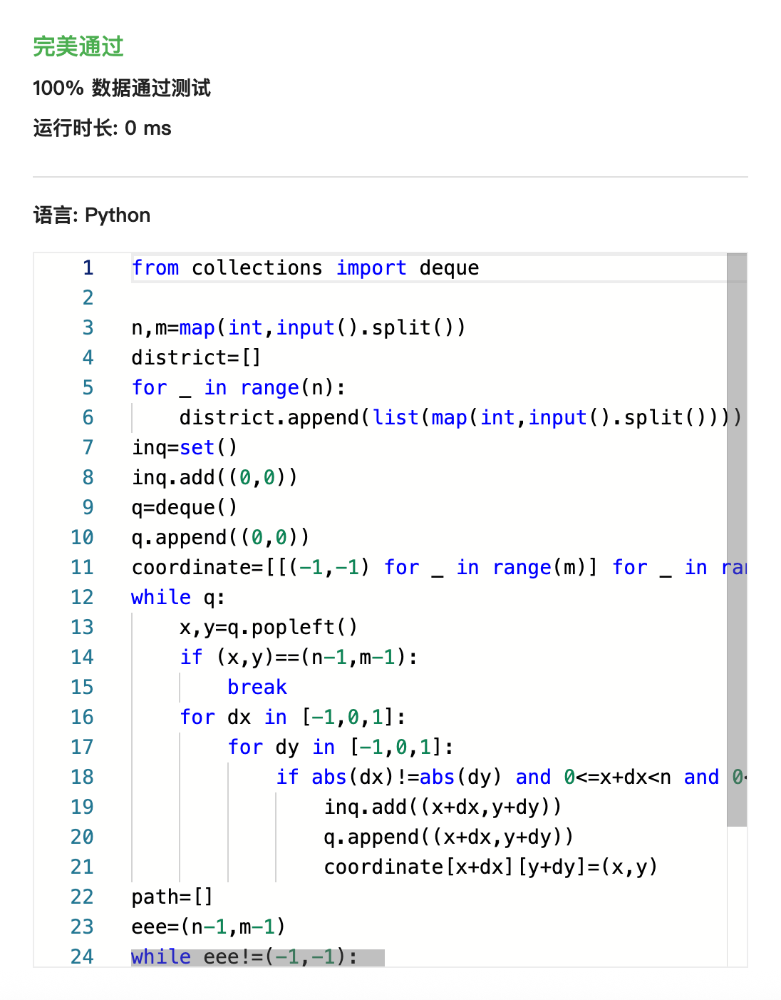
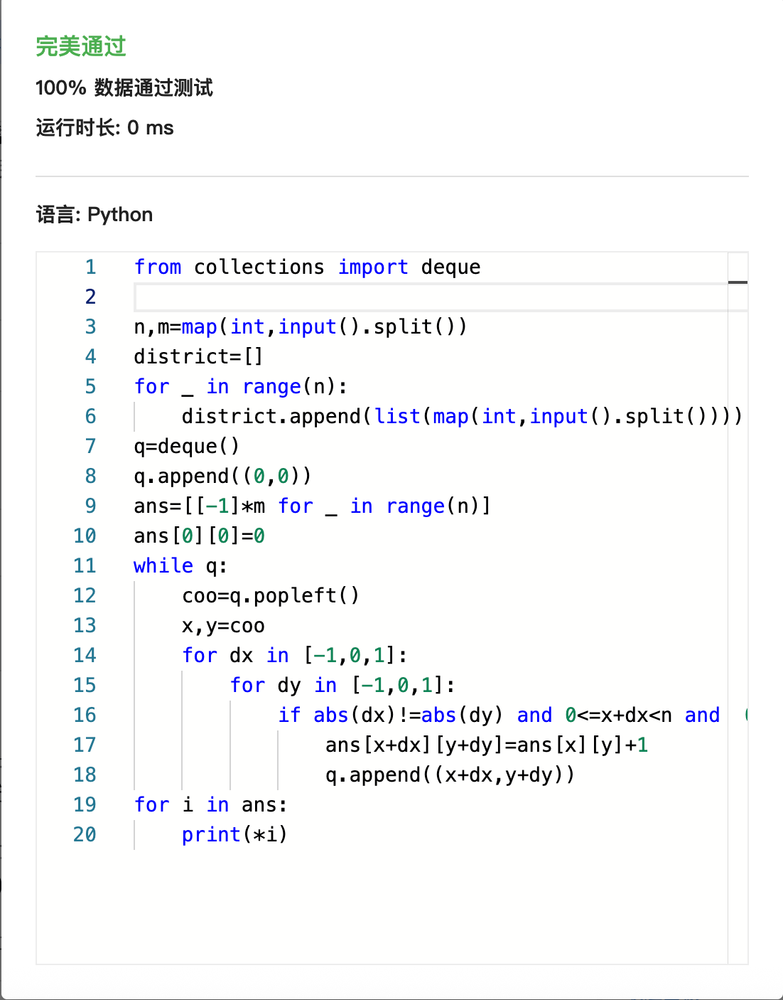
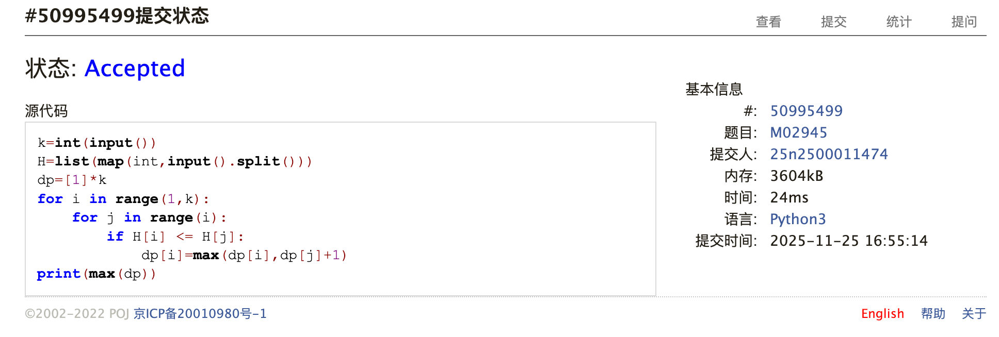
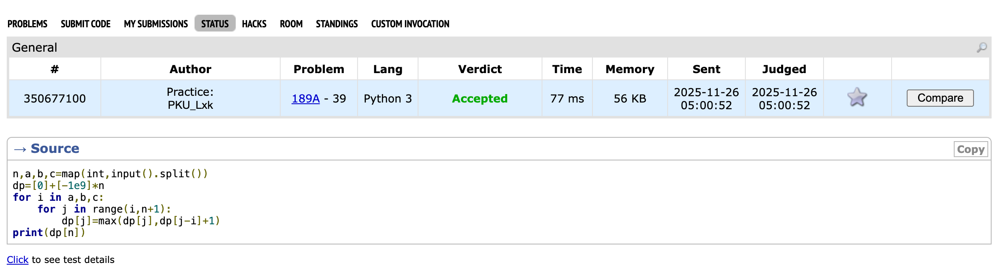
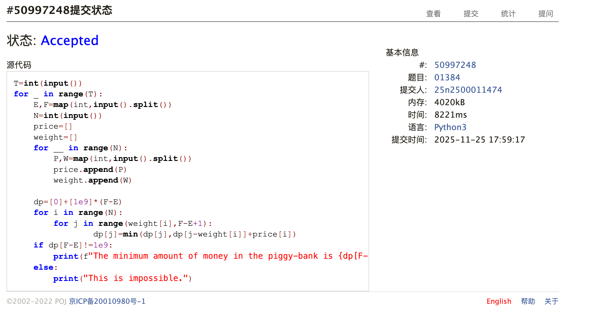
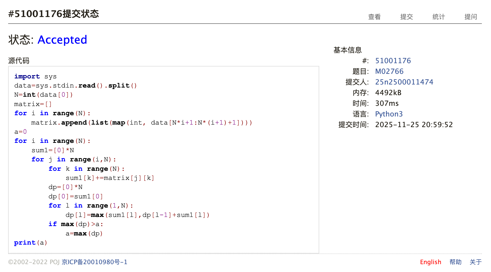
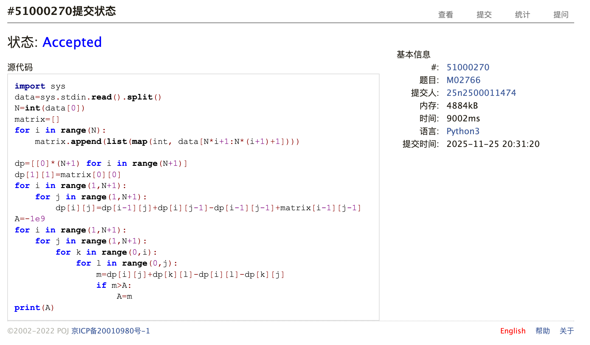

# Assignment #C: bfs & dp

Updated 1436 GMT+8 Nov 25, 2025

2025 fall, Complied by <mark>同学的姓名、院系</mark>


**说明：**

1）请把每个题目解题思路（可选），源码Python, 或者C++（已经在Codeforces/Openjudge上AC），截图（包含Accepted），填写到下面作业模版中（推荐使用 typora https://typoraio.cn ，或者用word）。AC 或者没有AC，都请标上每个题目大致花费时间。

2）提交时候先提交pdf文件，再把md或者doc文件上传到右侧“作业评论”。Canvas需要有同学清晰头像、提交文件有pdf、"作业评论"区有上传的md或者doc附件。

3）如果不能在截止前提交作业，请写明原因。


## 1. 题目

### sy321迷宫最短路径

bfs, https://sunnywhy.com/sfbj/8/2/321

思路：这题想了很久，最后还是看了讲义上的题解，感觉自己确实想不到bfs的基础上题解这样的输出方式。


代码：

```python
from collections import deque

n,m=map(int,input().split())
district=[]
for _ in range(n):
    district.append(list(map(int,input().split())))
inq=set()
inq.add((0,0))
q=deque()
q.append((0,0))
coordinate=[[(-1,-1) for _ in range(m)] for _ in range(n)]
while q:
    x,y=q.popleft()
    if (x,y)==(n-1,m-1):
        break
    for dx in [-1,0,1]:
        for dy in [-1,0,1]:
            if abs(dx)!=abs(dy) and 0<=x+dx<n and 0<=y+dy<m and (x+dx,y+dy) not in inq and district[x+dx][y+dy]==0:
                inq.add((x+dx,y+dy))
                q.append((x+dx,y+dy))
                coordinate[x+dx][y+dy]=(x,y)
path=[]
eee=(n-1,m-1)
while eee!=(-1,-1):
    path.append(eee)
    eee=coordinate[eee[0]][eee[1]]
path.reverse()
for x in path:
    print(x[0]+1,x[1]+1)
```


代码运行截图 <mark>（至少包含有"Accepted"）</mark>



### sy324多终点迷宫问题

bfs, https://sunnywhy.com/sfbj/8/2/324

思路：这题友好很多，甚至不需要inq的集合，只需要ans里面判断是否为-1即可。


代码：

```python
from collections import deque

n,m=map(int,input().split())
district=[]
for _ in range(n):
    district.append(list(map(int,input().split())))
q=deque()
q.append((0,0))
ans=[[-1]*m for _ in range(n)]
ans[0][0]=0
while q:
    coo=q.popleft()
    x,y=coo
    for dx in [-1,0,1]:
        for dy in [-1,0,1]:
            if abs(dx)!=abs(dy) and 0<=x+dx<n and  0<=y+dy<m and district[x+dx][y+dy]==0 and ans[x+dx][y+dy]==-1:
                ans[x+dx][y+dy]=ans[x][y]+1
                q.append((x+dx,y+dy))
for i in ans:
    print(*i)
```


代码运行截图 <mark>（至少包含有"Accepted"）</mark>



### M02945: 拦截导弹

dp, greedy http://cs101.openjudge.cn/pctbook/M02945

思路：感觉这题思路也不是很好想，一开始还没理解题意当成了背包……


代码：

```python
k=int(input())
H=list(map(int,input().split()))
dp=[1]*k
for i in range(1,k):
    for j in range(i):
        if H[i] <= H[j]:
            dp[i]=max(dp[i],dp[j]+1)
print(max(dp))
```


代码运行截图 <mark>（至少包含有"Accepted"）</mark>



### 189A. Cut Ribbon

brute force/dp, 1300, https://codeforces.com/problemset/problem/189/A

思路：完全背包问题，一开始当成上周作业去做，老师上课讲到后明白了改一下遍历顺序即可


代码：

```python
n,a,b,c=map(int,input().split())
dp=[0]+[-1e9]*n
for i in a,b,c:
    for j in range(i,n+1):
        dp[j]=max(dp[j],dp[j-i]+1)
print(dp[n])
```


代码运行截图 <mark>（至少包含有"Accepted"）</mark>



### M01384: Piggy-Bank

dp, http://cs101.openjudge.cn/practice/01384/

思路：完全背包求最小值，一开始没意识到要在列表里设无穷小导致调了很久没成功。


代码：

```python
T=int(input())
for _ in range(T):
    E,F=map(int,input().split())
    N=int(input())
    price=[]
    weight=[]
    for __ in range(N):
        P,W=map(int,input().split())
        price.append(P)
        weight.append(W)

    dp=[0]+[1e9]*(F-E)
    for i in range(N):
        for j in range(weight[i],F-E+1):
                dp[j]=min(dp[j],dp[j-weight[i]]+price[i])
    if dp[F-E]!=1e9:
        print(f"The minimum amount of money in the piggy-bank is {dp[F-E]}.")
    else:
        print("This is impossible.")
```


代码运行截图 <mark>（至少包含有"Accepted"）</mark>



### M02766: 最大子矩阵

dp, kadane, http://cs101.openjudge.cn/pctbook/M02766

思路：这题太水了，前缀和O(N^4)都能过，更别说kadane了，唯一恶心人的是猎奇的输入方式。


代码：

```python
import sys
data=sys.stdin.read().split()
N=int(data[0])
matrix=[]
for i in range(N):
    matrix.append(list(map(int, data[N*i+1:N*(i+1)+1])))
a=0
for i in range(N):
    sum1=[0]*N
    for j in range(i,N):
        for k in range(N):
            sum1[k]+=matrix[j][k]
        dp=[0]*N
        dp[0]=sum1[0]
        for l in range(1,N):
            dp[l]=max(sum1[l],dp[l-1]+sum1[l])
        if max(dp)>a:
            a=max(dp)
print(a)
```
```python
import sys
data=sys.stdin.read().split()
N=int(data[0])
matrix=[]
for i in range(N):
    matrix.append(list(map(int, data[N*i+1:N*(i+1)+1])))

dp=[[0]*(N+1) for i in range(N+1)]
dp[1][1]=matrix[0][0]
for i in range(1,N+1):
    for j in range(1,N+1):
        dp[i][j]=dp[i-1][j]+dp[i][j-1]-dp[i-1][j-1]+matrix[i-1][j-1]
A=-1e9
for i in range(1,N+1):
    for j in range(1,N+1):
        for k in range(0,i):
            for l in range(0,j):
                m=dp[i][j]+dp[k][l]-dp[i][l]-dp[k][j]
                if m>A:
                    A=m
print(A)
```


代码运行截图 <mark>（至少包含有"Accepted"）</mark>




## 2. 学习总结和收获
最近在把讲义所有题目都做完，感觉收获比较大，复习了排序算法、greedy以及一点递归，以及发现bisect其实早就讲过。目前计划在机考前把所有模块都系统的做一遍。


