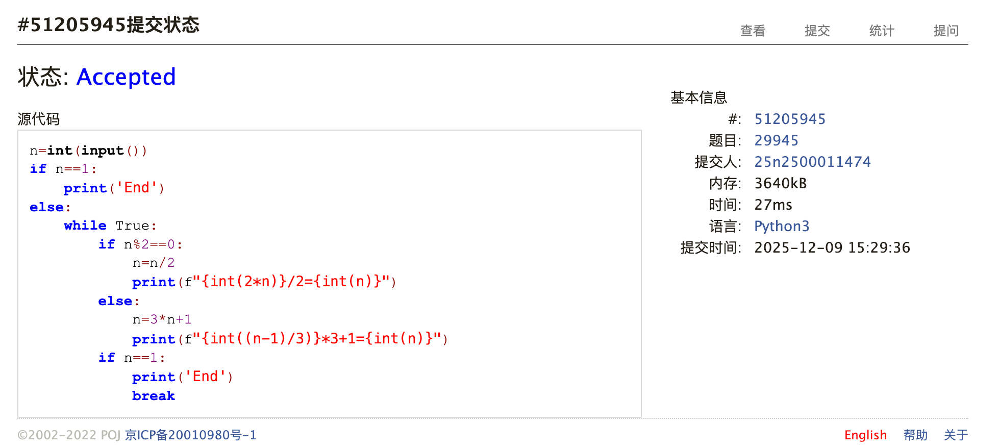
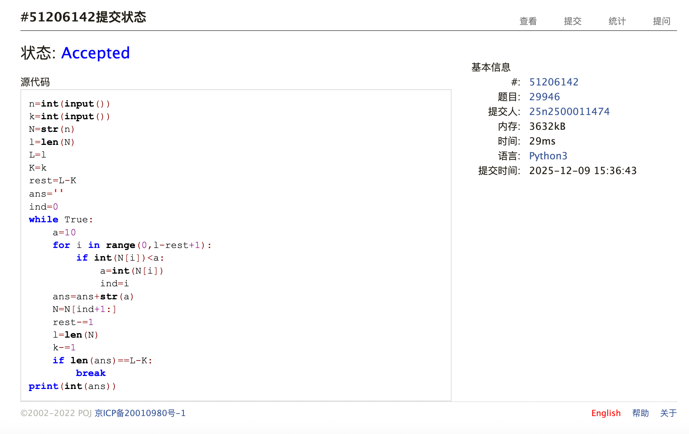
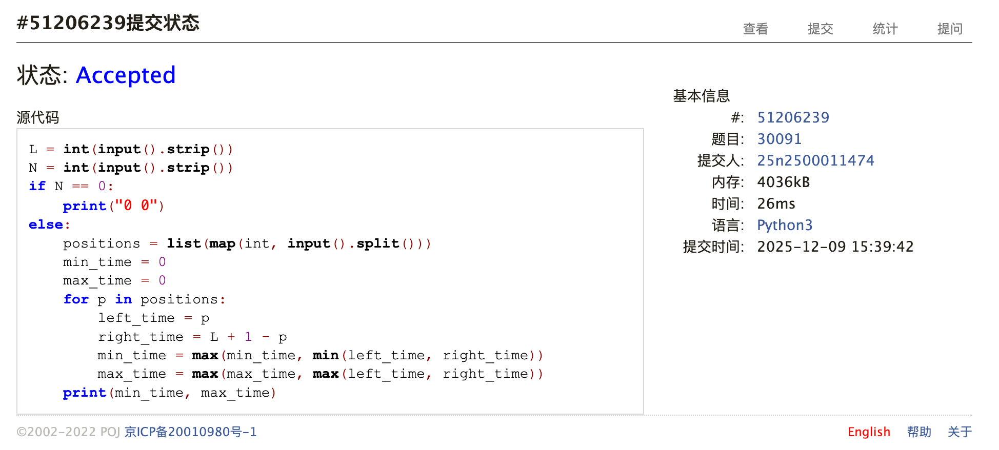
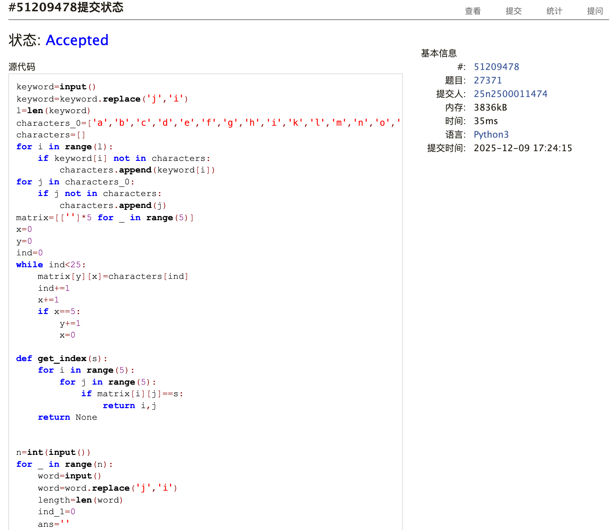
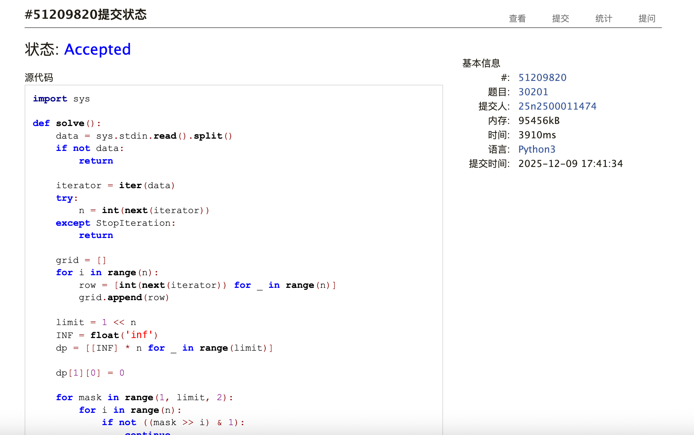
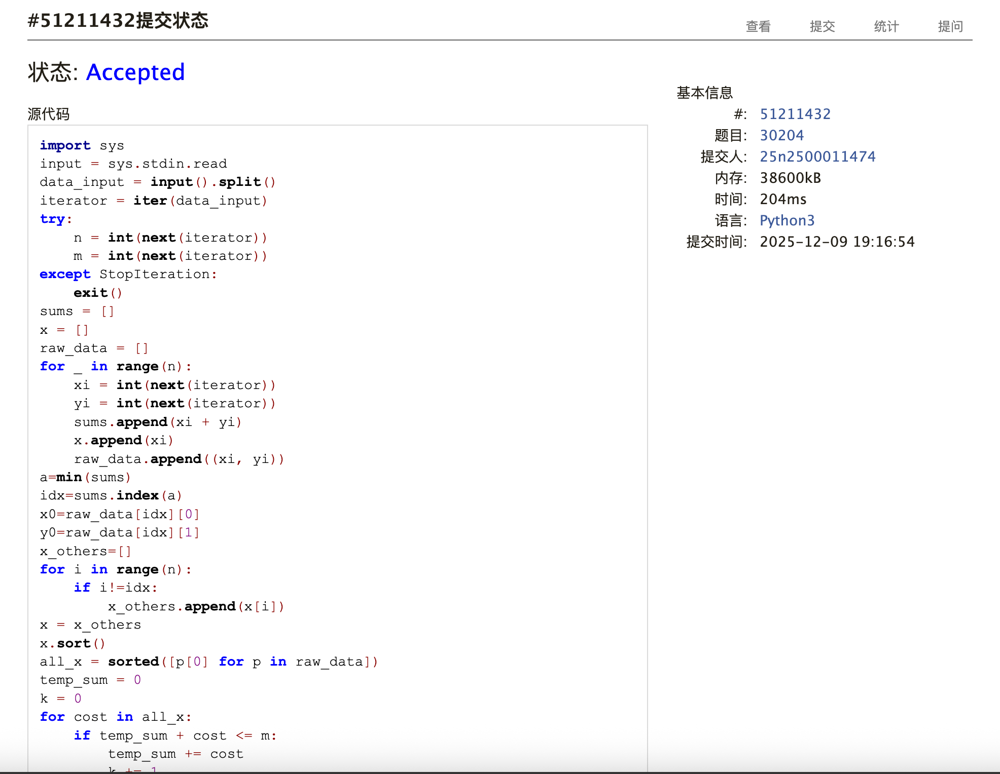

# Assignment #D: Mock Exam下元节

Updated 1729 GMT+8 Dec 4, 2025

2025 fall, Complied by <mark>同学的姓名、院系</mark>


>**说明：**
>
>1. Dec⽉考： AC6<mark>（请改为同学的通过数）</mark> 。考试题⽬都在“题库（包括计概、数算题目）”⾥⾯，按照数字题号能找到，可以重新提交。作业中提交⾃⼰最满意版本的代码和截图。
>
>2. 解题与记录：对于每一个题目，请提供其解题思路（可选），并附上使用Python或C++编写的源代码（确保已在OpenJudge， Codeforces，LeetCode等平台上获得Accepted）。请将这些信息连同显示“Accepted”的截图一起填写到下方的作业模板中。（推荐使用Typora https://typoraio.cn 进行编辑，当然你也可以选择Word。）无论题目是否已通过，请标明每个题目大致花费的时间。
>
>3. 提交安排：提交时，请首先上传PDF格式的文件，并将.md或.doc格式的文件作为附件上传至右侧的“作业评论”区。确保你的Canvas账户有一个清晰可见的本人头像，提交的文件为PDF格式，并且“作业评论”区包含上传的.md或.doc附件。
> 
>4. 延迟提交：如果你预计无法在截止日期前提交作业，请提前告知具体原因。这有助于我们了解情况并可能为你提供适当的延期或其他帮助。  
>
>请按照上述指导认真准备和提交作业，以保证顺利完成课程要求。


## 1. 题目

### E29945:神秘数字的宇宙旅行 

implementation, http://cs101.openjudge.cn/practice/29945

思路：签到题


代码

```python
n=int(input())
if n==1:
    print('End')
else:
    while True:
        if n%2==0:
            n=n/2
            print(f"{int(2*n)}/2={int(n)}")
        else:
            n=3*n+1
            print(f"{int((n-1)/3)}*3+1={int(n)}")
        if n==1:
            print('End')
            break
```


代码运行截图 <mark>（至少包含有"Accepted"）</mark>



### E29946:删数问题

monotonic stack, greedy, http://cs101.openjudge.cn/practice/29946

思路：由于数据范围小，考试的时候迅速想到了贪心思路并写出，但是可恶的前导零坑到，找了半天错才试出来这个情况，在发现这个情况后还犹豫了很久是否需要把0去掉。说实话感觉如果在期末作为E题，这个前导零最好还是说清楚为好。


代码

```python
n=int(input())
k=int(input())
N=str(n)
l=len(N)
L=l
K=k
rest=L-K
ans=''
ind=0
while True:
    a=10
    for i in range(0,l-rest+1):
        if int(N[i])<a:
            a=int(N[i])
            ind=i
    ans=ans+str(a)
    N=N[ind+1:]
    rest-=1
    l=len(N)
    k-=1
    if len(ans)==L-K:
        break
print(int(ans))
```


代码运行截图 <mark>（至少包含有"Accepted"）</mark>



### E30091:缺德的图书馆管理员

greedy, http://cs101.openjudge.cn/practice/30091

思路：本来是很简单的题，但是一开始被错误的题干误导了，处理成了相遇之后同向运动，也被卡了好久……还好题干的两个说法都尝试了


代码

```python
L = int(input().strip())
N = int(input().strip())
if N == 0:
    print("0 0")
else:
    positions = list(map(int, input().split()))
    min_time = 0
    max_time = 0
    for p in positions:
        left_time = p
        right_time = L + 1 - p
        min_time = max(min_time, min(left_time, right_time))
        max_time = max(max_time, max(left_time, right_time))
    print(min_time, max_time)
```


代码运行截图 <mark>（至少包含有"Accepted"）</mark>



### M27371:Playfair密码

simulation，string，matrix, http://cs101.openjudge.cn/practice/27371


思路：这题真是又臭又长，感觉就是纯语法题，要求写的时候思路非常清晰，考试的时候耐着性子做完了，做完就没时间了……不知道是亏是赚


代码

```python
keyword=input()
keyword=keyword.replace('j','i')
l=len(keyword)
characters_0=['a','b','c','d','e','f','g','h','i','k','l','m','n','o','p','q','r','s','t','u','v','w','x','y','z']
characters=[]
for i in range(l):
    if keyword[i] not in characters:
        characters.append(keyword[i])
for j in characters_0:
    if j not in characters:
        characters.append(j)
matrix=[['']*5 for _ in range(5)]
x=0
y=0
ind=0
while ind<25:
    matrix[y][x]=characters[ind]
    ind+=1
    x+=1
    if x==5:
        y+=1
        x=0

def get_index(s):
    for i in range(5):
        for j in range(5):
            if matrix[i][j]==s:
                return i,j
    return None

n=int(input())
for _ in range(n):
    word=input()
    word=word.replace('j','i')
    length=len(word)
    ind_1=0
    ans=''
    pairs=[]
    while ind_1<length-1:
        if word[ind_1]!=word[ind_1+1]:
            pairs.append(word[ind_1]+word[ind_1+1])
            ind_1+=2
        else:
            if word[ind_1]!='x':
                pairs.append(word[ind_1]+'x')
                ind_1+=1
            else:
                pairs.append(word[ind_1]+'q')
                ind_1+=1
    if ind_1==length-1:
        if word[ind_1]!='x':
            pairs.append(word[ind_1]+'x')
        else:
            pairs.append(word[ind_1]+'q')
    for s in pairs:
        y1,x1=get_index(s[0])
        y2,x2=get_index(s[1])
        if y1==y2:
            if x1+1<5:
                a1=x1+1
            else:
                a1=0
            if x2+1<5:
                a2=x2+1
            else:
                a2=0
            ans+=matrix[y1][a1]+matrix[y2][a2]
        elif x1==x2:
            if y1+1<5:
                b1=y1+1
            else:
                b1=0
            if y2+1<5:
                b2=y2+1
            else:
                b2=0
            ans+=matrix[b1][x1]+matrix[b2][x2]
        else:
            ans+=matrix[y1][x2]+matrix[y2][x1]
    print(ans)
```


代码运行截图 <mark>（至少包含有"Accepted"）</mark>



### T30201:旅行售货商问题

dp,dfs, http://cs101.openjudge.cn/practice/30201

思路：自己想了30min没有任何写的思路，所以问了ai，感觉确实不是自己能做的，毕竟自己对位操作和状态压缩都不太熟悉。


代码

```python
import sys

def solve():
    data = sys.stdin.read().split()
    if not data:
        return
    
    iterator = iter(data)
    try:
        n = int(next(iterator))
    except StopIteration:
        return
    
    grid = []
    for i in range(n):
        row = [int(next(iterator)) for _ in range(n)]
        grid.append(row)
        
    limit = 1 << n
    INF = float('inf')
    dp = [[INF] * n for _ in range(limit)]
    
    dp[1][0] = 0
    
    for mask in range(1, limit, 2):
        for i in range(n):
            if not ((mask >> i) & 1):
                continue
            
            prev_mask = mask ^ (1 << i)
            if prev_mask == 0:
                continue
            
            min_val = INF
            for j in range(n):
                if (prev_mask >> j) & 1:
                    cost = dp[prev_mask][j] + grid[j][i]
                    if cost < min_val:
                        min_val = cost
            
            dp[mask][i] = min_val
                
    ans = INF
    full_mask = limit - 1
    for i in range(1, n):
        cost = dp[full_mask][i] + grid[i][0]
        if cost < ans:
            ans = cost
            
    print(ans)

if __name__ == '__main__':
    solve()
```


代码运行截图 <mark>（至少包含有"Accepted"）</mark>



### T30204:小P的LLM推理加速

greedy, http://cs101.openjudge.cn/practice/30204

思路：自己想了好一会，感觉考试先做这个说不定更赚。思路是：由于每个推理必须要先消耗xi，所以先计算取xi的个数，如果还有能量就取最小的xi+yi。至于取多少个xi，枚举就好了。


代码

```python
import sys
input = sys.stdin.read
data_input = input().split()
iterator = iter(data_input)
try:
    n = int(next(iterator))
    m = int(next(iterator))
except StopIteration:
    exit()
sums = []
x = []
raw_data = []
for _ in range(n):
    xi = int(next(iterator))
    yi = int(next(iterator))
    sums.append(xi + yi)
    x.append(xi)
    raw_data.append((xi, yi))
a=min(sums)
idx=sums.index(a)
x0=raw_data[idx][0]
y0=raw_data[idx][1]
x_others=[]
for i in range(n):
    if i!=idx:
        x_others.append(x[i])
x = x_others
x.sort()
all_x = sorted([p[0] for p in raw_data])
temp_sum = 0
k = 0
for cost in all_x:
    if temp_sum + cost <= m:
        temp_sum += cost
        k += 1
    else:
        break
sum_i = 0
if m >= x0:
    rest=m-x0
    times=1+(rest//a)*2
    if rest%a>=y0:
        times+=1
    if times>k:
        k=times
for i in range(len(x)):
    sum_i+=x[i]
    total_cost=x0+sum_i
    if total_cost>m:
        break
    rest=m-total_cost
    times=(i+2)+(rest//a)*2
    if rest%a>=y0:
        times+=1
    if times>k:
        k=times
print(k)
```


代码运行截图 <mark>（至少包含有"Accepted"）</mark>



## 2. 学习总结和收获
感觉这次月考题目表述非常难受，如果不因为这些浪费时间感觉有机会ac5？不过自己考场上也不一定想的出来最后一题的贪心。个人从这次考试和老师对期末考题的“承诺”来看，自己应该还是得多复习基本的算法，保证自己E和M的正确率吧，争取机考能ac5。


